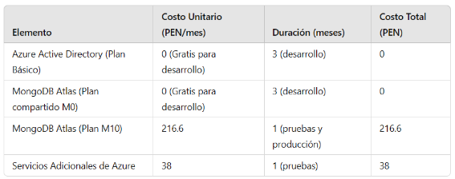
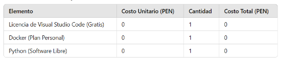
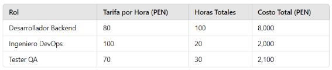
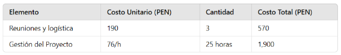
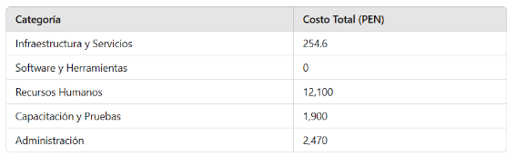



**UNIVERSIDAD PRIVADA DE TACNA**

**FACULTAD DE INGENIERÍA**

**Escuela Profesional de Ingeniería de Sistemas**

` `***Apis y Funciones***

Curso: *Tópicos de Base de Datos Avanzados I*

Docente: *Mag. Patrick Cuadros Quiroga*

Integrantes:

***Meza Noallca, Jean Marco			 	 (2021069823)***

***Castañeda Centurion, Jorge Enrique		           (2021069822)***

`			           				 `***(2021070020)***

**Tacna – Perú**

***2024***

**Apis y Funciones**

**Informe de Factibilidad**

**Versión *2.0***

|CONTROL DE VERSIONES||||||
| :-: | :- | :- | :- | :- | :- |
|Versión|Hecha por|Revisada por|Aprobada por|Fecha|Motivo|
|1\.0|JM|JM|JM|27/11/2024|Versión Original|
|2\.0|JM|JM|JM|12/12/2024|Versión Original|

**ÍNDICE GENERAL**

[1. Descripción del Proyecto	](#_gjdgxs)

[1.1 Nombre del proyecto	](#_60ssvnsves2q)

[1.2 Duración del proyecto	](#_40emqd4tzmws)

[1.3 Descripción	](#_prg0ghuu903u)

[1.4 Objetivos	](#_6yh6rxyr60nl)

[1.4.1 Objetivo general	](#_pu18qnfx70zg)

[1.4.2 Objetivos Específicos	](#_qf6bjjofzj4v)

[2. Riesgos	](#_30j0zll)

[3. Análisis de la Situación actual	](#_1fob9te)

[3.1 Planteamiento del problema	](#_ywnei9xsgt0j)

[3.2 Consideraciones de hardware y software	](#_uxn75i95lrdu)

[4. Estudio de Factibilidad	](#_3znysh7)

[4.1 Factibilidad Técnica	](#_2et92p0)

[4.2 Factibilidad Económica	](#_tyjcwt)

[4.3 Factibilidad Operativa	](#_3dy6vkm)

[4.4 Factibilidad Legal	](#_1t3h5sf)

[4.5 Factibilidad Social	](#_4d34og8)

[4.6 Factibilidad Ambiental	](#_2s8eyo1)

[5. Análisis Financiero	](#_17dp8vu)

[6. Conclusiones	](#_3rdcrjn)

**Informe de Factibilidad**
1. # Descripción del Proyecto
   1. ## **Nombre del proyecto**
API Flask con Azure AD y MongoDB
1. ## **Duración del proyecto**
Inicio: 24 de Agosto

Fin: 13 de Diciembre

El proyecto tendrá una duración aproximada de 17 semanas.
1. ## **Descripción**
El proyecto tiene como propósito desarrollar una API segura y robusta que permita gestionar la autenticación y autorización de usuarios utilizando Azure Active Directory (Azure AD). La API implementará un control de acceso basado en roles (RBAC) para diferenciar los niveles de acceso de los usuarios, como administradores y usuarios generales, garantizando que cada uno acceda únicamente a las secciones correspondientes de la aplicación.

El sistema se complementará con MongoDB como base de datos, donde se almacenará la información relacionada con los usuarios, sus roles y actividades. Esto permitirá gestionar de forma eficiente las operaciones y mantener un registro seguro de las interacciones. Se utilizarán prácticas modernas de desarrollo, como el despliegue en contenedores Docker, para garantizar portabilidad y escalabilidad, lo que facilita la implementación tanto en entornos de prueba como en producción.

1. ## **Objetivos**
   1. ### **Objetivo general**
      Crear una API confiable y segura que integre mecanismos modernos de autenticación con Azure AD y un modelo de control de acceso basado en roles, utilizando MongoDB como sistema de almacenamiento para gestionar información de usuarios, roles y accesos.
   1. ### **Objetivos Específicos**
**Integración con Azure Active Directory:**

- **Objetivo:** Diseñar e implementar la integración de la API Flask con Azure Active Directory para gestionar la autenticación de usuarios.
- **Meta:** Lograr una autenticación segura para todos los usuarios, validando las credenciales directamente contra Azure AD y asegurando un tiempo de respuesta promedio de menos de 300 ms.

**Configuración de MongoDB Atlas:**

- **Objetivo:** Configurar y utilizar MongoDB Atlas como base de datos principal para almacenar información de usuarios, roles y actividades.
- **Meta:** Crear una estructura de base de datos eficiente que permita realizar consultas rápidas y asegurar la integridad de los datos con un índice de fallas menor al 1%.

**Implementación de Control de Acceso Basado en Roles (RBAC):**

- **Objetivo:** Implementar un modelo de control de acceso basado en roles (RBAC) en la API para definir permisos diferenciados entre administradores y usuarios generales.
- **Meta:** Garantizar que los usuarios accedan sólo a los recursos permitidos según su rol, con un porcentaje de error menor al 0.5% en la validación de roles.

**Despliegue con Docker:**

- **Objetivo:** Desplegar la API en contenedores Docker para asegurar la portabilidad y escalabilidad del sistema.
- **Meta:** Configurar un entorno de desarrollo, prueba y producción basado en Docker, logrando un despliegue automatizado en menos de 5 minutos.

**Pruebas de Rendimiento y Seguridad:**

- **Objetivo:** Realizar pruebas de rendimiento y seguridad para garantizar el correcto funcionamiento de la API bajo condiciones reales de uso.
- **Meta:** Validar que la API soporte al menos 500 usuarios concurrentes sin interrupciones y cumpla con los estándares de seguridad OWASP.

**Cumplimiento de Normativas de Protección de Datos:**

- **Objetivo:** Asegurar el cumplimiento de normativas de protección de datos personales mediante la implementación de medidas de seguridad, como cifrado y auditorías de acceso.
- **Meta:** Garantizar que el sistema cumpla con normativas internacionales, como GDPR o CCPA, desde su diseño y ejecución.

1. # Riesgos
- **Problemas de integración:** Puede haber incompatibilidades o configuraciones complejas al conectar Azure AD con Flask.

- **Latencia:** Si los servidores de Azure AD experimentan saturación, el tiempo de respuesta puede verse afectado.

1. # Análisis de la Situación actual
   1. ## **Planteamiento del problema**
      Actualmente, la organización no cuenta con un sistema unificado para gestionar la autenticación de usuarios y el acceso a los recursos internos. Esto genera riesgos, como accesos no autorizados, duplicidad de credenciales, y dificultades para gestionar permisos de forma centralizada. Un sistema de este tipo no solo mejora la seguridad, sino que también optimiza los procesos internos y reduce la carga administrativa.
   1. ## **Consideraciones de hardware y software**
Hardware:

- Servidor con al menos 4 GB de RAM para pruebas y despliegue inicial.
- Acceso a internet con ancho de banda suficiente para garantizar comunicación fluida con Azure AD y MongoDB Atlas.

Software (Aplicaciones y Herramientas de Desarrollo):

- **Frameworks y Bibliotecas:** Flask, MSAL, Gunicorn.
- **Herramientas de Desarrollo:** Python 3.12.5, Docker para contenedores, y un editor como Visual Studio Code.
- **Servicios en la Nube:** Azure Active Directory para autenticación y MongoDB Atlas para almacenamiento.

1. # **Estudio de Factibilidad**
   1. ## **Factibilidad Técnica**
      El uso de tecnologías ampliamente probadas y documentadas, como Flask y Azure AD, reduce el riesgo de problemas técnicos. Además, la experiencia previa del equipo con estas herramientas asegura un desarrollo más ágil.
   1. ## **Factibilidad Económica**
      Los costos iniciales son bajos gracias a los planes gratuitos de Azure AD y MongoDB Atlas para desarrollo. El modelo de costos escalables permite adaptarse a medida que el sistema crece.

      1. Costos de infraestructura y servicios en la nube

         

      2. Costos de software

         

      3. Costos de recursos humanos

         

      4. Costos generales de administración

         

      5. Tabla general de costos

         

         Costo total: S/. 16,724.6

   1. ## **Factibilidad Operativa**
      La estructura del proyecto permite una implementación gradual y modular, lo que facilita las pruebas y ajustes antes de su despliegue completo.
   1. ## **Factibilidad Legal**
      Se integrarán prácticas para cumplir con normativas internacionales de protección de datos, minimizando riesgos legales.
   1. ## **Factibilidad Social**
      El proyecto beneficiará directamente a los usuarios al ofrecer un sistema más seguro y confiable, mejorando su experiencia al interactuar con los servicios internos.
   1. ## **Factibilidad Ambiental**
      Al utilizar servicios en la nube, se minimiza el impacto ambiental al reducir la dependencia de infraestructura física, como servidores locales.
1. # **Conclusiones**
   La implementación de una API segura con Flask, Azure AD y MongoDB es un paso estratégico hacia la modernización de los sistemas internos. Este proyecto no solo mejora la seguridad, sino que también optimiza la experiencia del usuario y facilita la gestión de roles y accesos. Con un desarrollo bien planificado y herramientas de alto rendimiento, la organización podrá contar con una solución escalable, adaptable y alineada con las mejores prácticas del mercado.