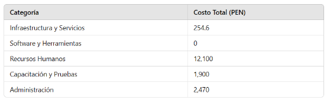



**UNIVERSIDAD PRIVADA DE TACNA**

**FACULTAD DE INGENIERÍA**

**Escuela Profesional de Ingeniería de Sistemas**

` `***Apis y Funciones***

Curso: *Tópicos de Base de Datos Avanzados I*

Docente: *Mag. Patrick Cuadros Quiroga*

Integrantes:

***Meza Noallca, Jean Marco			 	 (2021069823)***

***Castañeda Centurion, Jorge Enrique		           (2021069822)***

**Tacna – Perú**

***2024***

**Apis y Funciones**

**Documento de Visión**

**Versión *2.0***

|CONTROL DE VERSIONES||||||
| :-: | :- | :- | :- | :- | :- |
|Versión|Hecha por|Revisada por|Aprobada por|Fecha|Motivo|
|1\.0|JM|JM|JM|27/11/2024|Versión Original|
|2\.0|JM|JM|JM|12/12/2024|Versión Original|

**ÍNDICE GENERAL**

[1. Introducción	](#_czi3ubmlydrw)

[1.1 Propósito	](#_9bgjg54ipgrb)

[1.2 Alcance	](#_xgp9o990h7a5)

[1.3 Definiciones, Siglas y Abreviaturas	](#_iueqzxpf8i2v)

[1.4 Visión General	](#_bm37zolhxjy2)

[2. Posicionamiento	](#_udlw6a88cloo)

[2.1 Oportunidad de negocio	](#_c59rvjtbgjg1)

[2.2 Definición del problema	](#_9k5z6nf5h3yc)

[3. Descripcion de los interesados y usuarios	](#_k94cff4ma5vx)

[3.1 Resumen de los interesados	](#_ep283wxjiai4)

[3.2 Resumen de los usuarios	](#_z6eha2mk5hx3)

[3.3 Entorno de usuario	](#_16sngoj9rxx5)

[3.4 Perfiles de los interesados	](#_3emz2d4fkwrf)

[3.5 Perfiles de los usuarios	](#_lz4lxie9rjci)

[3.6 Necesidades de los interesados y usuarios	](#_fhkvt4s1haxi)

[4. Vista General del Producto	](#_j261d53r9ao9)

[4.1 Perspectiva del producto	](#_ko90lskwvn31)

[4.2 Resumen de capacidades	](#_ov1ctr45jekl)

[4.3 Suposiciones y dependencias	](#_moxjf6lu1uhs)

[4.4 Costos y precios	](#_at971ohxljhn)

[4.5 Licenciamiento e instalación	](#_p7htd2n9qbe1)

[5. Características del Producto	](#_7ixvgqyt0ya6)

[6. Restricciones	](#_1ue34u8zzs0k)

[7. Rango de Calidad	](#_227un06oilzp)

[8. Precedencia y Prioridad	](#_ma2hz46kuhlp)

[9. Otros requerimientos del producto	](#_3ep5oo4c73m4)

[10. Conclusiones	](#_y2pw19avkoso)

[11. Recomendaciones	](#_mkoneukg8nrx)

[1. Monitoreo y evaluación continua:	](#_ua2s2mz7yo8h)

[2. Capacitación del personal:	](#_efe2gav2kxu)

[3. Mejoras futuras en el sistema:	](#_ump2iv8gc5wz)

[4. Preparación para el crecimiento:	](#_9rwi6skax6c)

[5. Cumplimiento normativo proactivo:	](#_5ezbt3xg92ri)

[6. Retroalimentación de los usuarios:	](#_sv03cn6fxlth)

[7. Seguridad como prioridad:	](#_m1wi3wgxinv8)

[12. Bibliografía	](#_l2zz213inq67)

**Documento de Visión**

1. # **Introducción**
## **1.1 Propósito**
- El propósito de este documento es definir la visión, los objetivos, y los requisitos principales del proyecto API Flask con Azure AD y MongoDB, cuyo enfoque es proporcionar un sistema robusto de autenticación y autorización basado en Azure Active Directory (Azure AD) y MongoDB. Este documento servirá como referencia para los equipos de desarrollo, pruebas y despliegue, asegurando un entendimiento común sobre el alcance y las expectativas del proyecto.

## **1.2 Alcance**
El proyecto API Flask con Azure AD y MongoDB ofrecerá un sistema de autenticación y control de acceso basado en roles (RBAC). Estará diseñado para ser utilizado por organizaciones que necesiten administrar de forma centralizada el acceso a sus recursos internos. Las características clave incluyen:

- Integración con Azure AD para autenticación.
- Gestión de roles (administradores y usuarios generales).
- Base de datos MongoDB para almacenar información de usuarios y roles.
- Despliegue en contenedores Docker para escalabilidad y portabilidad.
- Cumplimiento con normativas de protección de datos como GDPR o CCPA.

## **1.3 Definiciones, Siglas y Abreviaturas**
- **API**: Interfaz de Programación de Aplicaciones (Application Programming Interface).
- **Azure AD**: Azure Active Directory, sistema de autenticación en la nube de Microsoft.
- **RBAC**: Control de Acceso Basado en Roles (Role-Based Access Control).
- **MongoDB Atlas**: Servicio de base de datos NoSQL basado en la nube.
- **MSAL**: Microsoft Authentication Library, biblioteca para manejar autenticaciones con Azure AD.
- **TLS**: Seguridad en la capa de transporte (Transport Layer Security)

## **1.4 Visión General**
El producto está diseñado para actuar como un puente seguro y eficiente entre Azure Active Directory (Azure AD) y MongoDB Atlas, ofreciendo una solución escalable para la gestión de usuarios y roles. Con un enfoque en la seguridad y la facilidad de uso, el sistema permite a las organizaciones centralizar procesos de autenticación y autorización, garantizando el cumplimiento de normativas internacionales de protección de datos.

Su arquitectura escalable y su integración con Docker facilitan el despliegue en diferentes entornos, asegurando un rendimiento óptimo incluso con un crecimiento sostenido en el número de usuarios. Además, combina la robustez de Azure AD para la autenticación con el almacenamiento seguro y confiable de MongoDB, asegurando una experiencia eficiente tanto para administradores como para usuarios finales.

1. # **Posicionamiento**
   ## **2.1 Oportunidad de negocio**
- El creciente número de amenazas cibernéticas y la necesidad de centralizar la gestión de accesos hacen imperativa la adopción de sistemas robustos de autenticación y autorización. Este proyecto permite a las organizaciones gestionar usuarios y roles de forma eficiente, reduciendo riesgos de accesos no autorizados y optimizando recursos internos.

## **2.2 Definición del problema**
- Actualmente, las organizaciones enfrentan dificultades para administrar el acceso de los usuarios a sus sistemas internos, debido a:
  - Falta de integración entre sistemas.
  - Duplicidad de credenciales y riesgos de seguridad.
  - Ausencia de control de roles centralizado.

Nos hemos propuesto resolver estos problemas mediante un sistema unificado que combine autenticación, autorización y almacenamiento eficiente.

1. # **Descripcion de los interesados y usuarios**
   ## **3.1 Resumen de los interesados**
- **Administradores de sistemas**: Son responsables de configurar y mantener la integración entre la API, Azure AD, y MongoDB. Este rol es clave para garantizar que el sistema opere de manera eficiente y cumpla con los estándares de seguridad. Entre sus responsabilidades específicas se incluyen:
  - Configurar la infraestructura necesaria para la autenticación y el almacenamiento de datos.
  - Asegurar que todas las conexiones sean seguras utilizando protocolos como TLS.
  - Implementar políticas de acceso y escalabilidad para soportar el crecimiento del sistema.
  - Identificar y solucionar problemas técnicos que puedan surgir, especialmente relacionados con la conectividad o el rendimiento de los servicios externos.

- **Desarrolladores**: Los desarrolladores son los encargados de diseñar, implementar y mantener la API que servirá como intermediaria entre Azure AD y MongoDB. Este grupo tiene un papel crucial en la creación de un producto funcional, seguro y escalable. Sus principales actividades incluyen:
  - Diseñar y desarrollar endpoints que permitan la autenticación de usuarios y la gestión de roles.
  - Implementar controles de acceso basados en roles (RBAC) para garantizar que los usuarios interactúen únicamente con los recursos que tienen asignados.
  - Realizar pruebas exhaustivas para detectar y solucionar vulnerabilidades en el sistema.
  - Documentar las funcionalidades y mantener el código para facilitar futuras actualizaciones o cambios.

- **Gerentes de TI**: Los gerentes de TI supervisan el proyecto desde una perspectiva estratégica, asegurando que el sistema cumpla con las normativas internacionales de seguridad y con los objetivos organizativos. Sus tareas incluyen:
  - Monitorear el cumplimiento de estándares de protección de datos, como GDPR o CCPA.
  - Revisar informes de actividad que reflejen el uso del sistema, detección de posibles brechas de seguridad y desempeño general.
  - Definir prioridades para mejoras o actualizaciones, alineando las decisiones técnicas con las necesidades de negocio.
  - Coordinar con los administradores de sistemas y los desarrolladores para garantizar que las políticas de acceso y seguridad sean implementadas de forma correcta.

## **3.2 Resumen de los usuarios**
- **Administradores**: Este grupo representa a los usuarios que tienen privilegios elevados dentro del sistema. Su rol principal es gestionar los usuarios y roles de la organización. Entre sus tareas específicas se incluyen:
  - Crear y configurar nuevos usuarios en la plataforma.
  - Modificar los permisos de acceso según los cambios en las políticas internas.
  - Eliminar usuarios que ya no necesitan acceso al sistema.
  - Revisar logs de actividad para identificar posibles intentos de acceso no autorizado o anomalías en el uso de recursos.

- **Usuarios generales**: Los usuarios generales representan al grupo más amplio de personas que interactúan con el sistema. Son los usuarios finales que acceden a recursos específicos según los roles asignados. Sus actividades principales incluyen:
  - Acceder a aplicaciones cliente o interfaces web para utilizar funcionalidades específicas proporcionadas por la API.
  - Consultar información o realizar operaciones dentro de los límites establecidos por su rol.
  - Proporcionar retroalimentación sobre el sistema en caso de que encuentren problemas de acceso o rendimiento.

## **3.3 Entorno de usuario**
- El entorno de usuario está diseñado para garantizar una interacción fluida entre los usuarios y el sistema, permitiendo que cada perfil cumpla con sus tareas asignadas de manera eficiente.
  - **Interacción Técnica**
    - Aplicaciones cliente, que incluyen herramientas desarrolladas específicamente para consumir los endpoints del sistema.
    - Interfaces web diseñadas para la administración de usuarios y recursos.
    - Sistemas automatizados que realizan solicitudes API para tareas recurrentes, como auditorías o generación de reportes.

  - **Requisitos Operativos**
    - Es necesario que los dispositivos de los usuarios cuenten con conexión a internet para comunicarse con Azure AD y MongoDB Atlas.
    - Las comunicaciones están protegidas mediante protocolos de seguridad como TLS, garantizando la confidencialidad e integridad de los datos.

  - **Entorno Funcional**
    - Los administradores requieren interfaces que permitan realizar cambios de configuración de forma eficiente y con validaciones que eviten errores críticos.
    - Los usuarios generales necesitan una experiencia ágil que les permita enfocarse en sus actividades sin interrupciones.

## **3.4 Perfiles de los interesados**
- **Gerentes de TI**:
  - **Responsabilidades clave:**
    - Revisión y aprobación de políticas de acceso.
    - Supervisión de los estándares de seguridad y cumplimiento normativo.

  - **Expectativas:** Informes detallados y herramientas de monitoreo que les permitan tomar decisiones estratégicas rápidamente.

- **Administradores de sistemas**: 
  - **Responsabilidades clave:**
    - Configuración inicial y monitoreo continuo de la infraestructura.
    - Resolución de problemas técnicos y gestión de las integraciones entre servicios externos.

  - **Expectativas:** Acceso a herramientas de diagnóstico y documentación técnica para soporte y mejora continua.

## **3.5 Perfiles de los usuarios**
- **Administradores**:
  - Necesidades:
    - Control total sobre las operaciones relacionadas con usuarios y roles.
    - Interfaz simplificada para gestionar tareas críticas sin necesidad de conocimientos técnicos avanzados.

- **Usuarios generales**:
  - Necesidades:
    - Acceso rápido y seguro a las funcionalidades que requieren para cumplir con sus objetivos laborales.
    - Confianza en que el sistema protegerá sus datos personales y evitará accesos no autorizados.

## **3.6 Necesidades de los interesados y usuarios**
- **Gerentes de TI**:
  - **Prioridades:** Acceso a reportes detallados de actividad y auditorías, con alertas automatizadas en caso de anomalías.

- **Administradores**:
  - **Prioridades:** Capacidad de configurar rápidamente servicios externos y garantizar su disponibilidad a través de herramientas de monitoreo avanzadas.

- **Usuarios generales**:
  - **Prioridades:** Interacción rápida y sin interrupciones con las aplicaciones cliente, respaldada por un sistema altamente disponible y seguro.

1. # **Vista General del Producto**
   ## **4.1 Perspectiva del producto**
- El sistema propuesto actúa como una solución integral para la gestión de usuarios y roles en un entorno digital seguro y escalable. Sirve como intermediario entre **Azure Active Directory (Azure AD)** y **MongoDB**, ofreciendo a las organizaciones la capacidad de autenticar usuarios mediante un proveedor confiable y almacenar datos de manera eficiente en una base de datos robusta y flexible.

## **4.2 Resumen de capacidades**
- El sistema incluye las siguientes capacidades clave, diseñadas para abordar las necesidades de seguridad, gestión y escalabilidad:
  - **Autenticación mediante Azure AD:** La integración con Azure AD asegura que solo los usuarios autorizados puedan acceder al sistema. Esta autenticación soporta:
    - Métodos multifactor (MFA) para mayor seguridad.
    - Compatibilidad con protocolos estándar como OAuth 2.0 y OpenID Connect.

  - **Almacenamiento seguro en MongoDB:** La información relacionada con usuarios y roles se almacena en MongoDB Atlas, que ofrece:
    - Encriptación de datos en reposo y en tránsito.
    - Respaldo automático y recuperación ante desastres.
    - Flexibilidad para manejar datos relacionales y no relacionales.

  - **Control de acceso basado en roles (RBAC):** Los administradores pueden definir y asignar roles que determinan los recursos y acciones a los que cada usuario tiene acceso. Este sistema asegura que:
    - Los usuarios solo pueden interactuar con los recursos asignados.
    - Se eviten accesos no autorizados o errores operativos.

  - **Despliegue escalable con Docker:** La implementación del sistema mediante contenedores Docker garantiza:
    - Rápida puesta en marcha y configuración consistente en diferentes entornos.
    - Escalabilidad horizontal, permitiendo manejar cargas de trabajo crecientes.
    - Integración con orquestadores como Kubernetes para despliegues más complejos.

## **4.3 Suposiciones y dependencias**
- El correcto funcionamiento del sistema depende de las siguientes premisas:
  - **Disponibilidad de servicios externos:**
    - **Azure AD:** Se asume que el directorio de usuarios está configurado y accesible, con los permisos necesarios para realizar autenticaciones.
    - **MongoDB Atlas:** La base de datos debe estar operativa y configurada para permitir conexiones seguras desde el sistema.

  - **Seguridad en las comunicaciones:**
    - Se utilizará **TLS (Transport Layer Security)** para proteger todas las comunicaciones entre los servicios, evitando intercepciones de datos sensibles.

  - **Configuraciones iniciales:**
    - Se espera que los administradores hayan configurado correctamente los parámetros de integración con Azure AD y MongoDB antes de desplegar el sistema.

  - **Dependencia de conexión a internet:**
    - Dado que tanto Azure AD como MongoDB Atlas son servicios basados en la nube, una conexión a internet estable es indispensable para su operación.

## **4.4 Costos y precios**

Costo total: S/. 16,724.6

## **4.5 Licenciamiento e instalación** 
- **Licencias:**
  - **Azure AD:** Sujeto a los términos y condiciones de Microsoft, que incluyen diferentes niveles de suscripción según las funcionalidades requeridas.

  - **MongoDB Atlas:** Bajo la licencia SSPL (Server Side Public License), con diferentes niveles de servicio según el plan seleccionado.

- **Instalación:**
  - El sistema utiliza **Docker** para automatizar el proceso de instalación. Los contenedores preconfigurados simplifican la implementación, garantizando que todos los componentes funcionen correctamente desde el inicio.

  - Las configuraciones iniciales se manejan mediante scripts automatizados que permiten ajustar parámetros de integración y seguridad de manera eficiente.

1. # **Características del Producto**
- **Autenticación segura con Azure AD:**
  La integración garantiza un alto nivel de seguridad, utilizando estándares reconocidos y métodos modernos como la autenticación multifactor.

- **Control de acceso basado en roles (RBAC):**
  Este mecanismo asegura que cada usuario interactúa solo con los recursos permitidos, minimizando riesgos de seguridad.

- **Gestión centralizada de usuarios:**
  Permite a los administradores realizar tareas de alta complejidad, como asignación de roles y monitoreo de actividades, desde una interfaz unificada.

- **Cumplimiento con normativas internacionales:**
  El sistema está diseñado para cumplir con regulaciones como GDPR, CCPA y otras normativas de protección de datos, proporcionando tranquilidad a las organizaciones que lo implementan.

1. # **Restricciones**
- **Dependencia de servicios externos:** El sistema depende completamente de Azure AD para la autenticación y de MongoDB Atlas para el almacenamiento. Cualquier interrupción en estos servicios podría impactar en su funcionamiento.

- **Requiere conexión a internet:** Sin una conexión a internet activa, el sistema no puede operar, lo que lo limita en entornos offline.

1. # **Rango de Calidad**
**Escalabilidad:**

- Capacidad para soportar al menos **500 usuarios concurrentes** sin comprometer el rendimiento.

**Disponibilidad:**

- Garantizar un tiempo de actividad mínimo del **99.5%**, alineándose con los estándares de servicios empresariales modernos.

**Rendimiento:**

- Responder a solicitudes en un tiempo menor a **300 ms**, asegurando una experiencia fluida para los usuarios finales.

1. # **Precedencia y Prioridad**
- Integración con Azure AD: Alta prioridad.
- Configuración de MongoDB: Media prioridad.
- Pruebas de seguridad: Alta prioridad.

1. # **Otros requerimientos del producto**
   **9.1 Estándares legales:** 

El sistema deberá cumplir con las normativas legales aplicables en materia de protección de datos y privacidad, dependiendo de la jurisdicción donde sea implementado. Algunos de los estándares legales que deben ser considerados incluyen:

1. **Reglamento General de Protección de Datos (GDPR):**
- Aplicable a organizaciones que procesan datos personales de residentes de la Unión Europea.
- El sistema debe garantizar el derecho al acceso, rectificación y eliminación de datos personales de los usuarios.
- Deberá implementar mecanismos claros para el consentimiento explícito antes del procesamiento de datos personales.

1. **Ley de Portabilidad y Responsabilidad de Seguros de Salud (HIPAA):**
- Si se maneja información relacionada con la salud, el sistema deberá implementar medidas para proteger la información médica personal.

1. **Cumplimiento de auditorías externas:**
- El sistema deberá estar preparado para auditorías regulares que garanticen el cumplimiento de los estándares legales establecidos.

**9.2 Estándares de cumplimiento de la plataforma:** 

El sistema deberá alinearse con los estándares y mejores prácticas de las plataformas que utiliza, garantizando compatibilidad, seguridad y eficiencia.

1. **Azure Active Directory (Azure AD):**
- Cumplimiento con las políticas de seguridad y acceso definidas por Microsoft.
- Uso de métodos recomendados por Azure AD, como OAuth 2.0 y OpenID Connect, para la autenticación y autorización.

1. **MongoDB Atlas:**
- Implementar configuraciones de seguridad sugeridas por MongoDB, como el uso de encriptación en tránsito y en reposo.
- Seguir las guías de optimización de rendimiento y escalabilidad proporcionadas por la plataforma.

1. **Docker:**
- Cumplir con las mejores prácticas para la contenedorización, incluyendo:
  - Evitar el uso de contenedores privilegiados.
  - Actualizar regularmente las imágenes base para evitar vulnerabilidades conocidas.

1. **Certificaciones:**
- Garantizar que las configuraciones de Azure AD y MongoDB Atlas cumplan con estándares como **ISO/IEC 27001** y **SOC 2**, asegurando la protección de la información.

**9.3 Estándares de calidad y seguridad:** 

El sistema deberá ser diseñado y desarrollado considerando altos estándares de calidad y seguridad para garantizar su fiabilidad y robustez.

1. **Control de calidad:**
- Realizar pruebas exhaustivas en todas las etapas del desarrollo, incluyendo pruebas unitarias, de integración, funcionales y de carga.
- Garantizar la interoperabilidad entre los componentes del sistema, como Azure AD, MongoDB y Docker.

1. **Medidas de seguridad:**
- Implementar un sistema de detección y prevención de intrusiones para monitorear actividades sospechosas.
- Proteger las claves y credenciales utilizadas en la integración mediante servicios como Azure Key Vault.
- Aplicar principios de **seguridad por diseño**, como el menor privilegio y segmentación de acceso.

1. **Ciclo de vida de desarrollo seguro (SDL):**
- Incorporar análisis de vulnerabilidades desde las primeras etapas del desarrollo.
- Actualizar regularmente el sistema para parchear vulnerabilidades conocidas.

1. **Normas de cifrado:**
- Utilizar algoritmos de cifrado reconocidos como AES-256 para el almacenamiento de datos y TLS 1.2+ para comunicaciones seguras.

1. **Certificaciones de calidad:**
- Asegurar que el sistema cumple con normativas reconocidas como ISO 9001, que establece directrices para un sistema de gestión de calidad.

**9.4 Estándares de escalabilidad:** 

El diseño del sistema deberá permitir su escalabilidad horizontal y vertical para satisfacer el crecimiento de la organización y la demanda de los usuarios.

1. **Diseño escalable:**
- Implementar un enfoque basado en microservicios, donde cada componente del sistema pueda escalar de forma independiente según la carga.
- Usar contenedores Docker para facilitar la duplicación y gestión de servicios en diferentes entornos.

1. **Optimización de base de datos:**
- Configurar réplicas en MongoDB Atlas para manejar grandes volúmenes de lecturas y escrituras.
- Habilitar particionamiento (sharding) para dividir la base de datos en fragmentos manejables, mejorando el rendimiento y la capacidad.

1. **Escalabilidad de autenticación:**
- Garantizar que Azure AD pueda manejar solicitudes de autenticación masivas simultáneamente sin degradación del servicio.

1. **Pruebas de carga y estrés:**
- Realizar simulaciones de alto tráfico para identificar y mitigar cuellos de botella.
- Evaluar el rendimiento del sistema bajo diferentes escenarios, incluyendo picos de tráfico repentinos.

1. **Infraestructura en la nube:**
- Configurar el sistema para aprovechar servicios escalables en la nube, como Kubernetes para la orquestación de contenedores y balanceadores de carga para la distribución uniforme del tráfico.

1. **Planificación futura:**
- Diseñar con la previsión de soportar al menos 10 veces el tráfico esperado inicial, asegurando que el sistema no se convierta en un cuello de botella ante el crecimiento exponencial de usuarios.

1. # **Conclusiones**
   El proyecto ha sido diseñado para ofrecer una solución eficiente, segura y escalable que integra **Azure Active Directory (Azure AD)** y **MongoDB Atlas**, garantizando una gestión centralizada de usuarios y roles mediante un enfoque moderno de tecnologías basadas en contenedores y estándares de seguridad internacional.

1. **Aseguramiento de la seguridad:** Al implementar autenticación basada en Azure AD y encriptación avanzada para las comunicaciones y el almacenamiento de datos, el sistema cumple con las normativas más estrictas de protección de datos, como GDPR y CCPA.

1. **Optimización de la gestión de usuarios:** El uso de un modelo de control de acceso basado en roles (RBAC) facilita la asignación precisa de permisos, asegurando que los usuarios interactúen con el sistema solo dentro de los límites de sus responsabilidades.

1. **Escalabilidad y flexibilidad:** La arquitectura del sistema, basada en Docker y la nube, permite una fácil expansión y mantenimiento, haciendo frente a picos de tráfico y escalando a medida que crecen las necesidades de la organización.

1. **Cumplimiento de estándares internacionales:** A través de la adopción de estándares reconocidos de calidad, seguridad y escalabilidad, el sistema no solo mejora la eficiencia operativa, sino que también inspira confianza en los usuarios y stakeholders.

1. # **Recomendaciones**
Para maximizar el valor del sistema y garantizar su sostenibilidad a futuro, se sugieren las siguientes recomendaciones:
1. #### **Monitoreo y evaluación continua:**
- **Implementar herramientas de monitoreo:** Utilizar servicios como Azure Monitor y MongoDB Atlas Monitoring para rastrear el rendimiento y la salud del sistema en tiempo real.
- **Auditorías regulares de seguridad:** Programar evaluaciones trimestrales para identificar y abordar posibles vulnerabilidades en la infraestructura.

1. #### **Capacitación del personal:**
- **Entrenamiento en seguridad:** Capacitar a los administradores en el uso seguro y efectivo de Azure AD, MongoDB y Docker.
- **Actualización técnica:** Promover el aprendizaje continuo sobre nuevas herramientas y tecnologías relacionadas con la arquitectura del sistema.

1. #### **Mejoras futuras en el sistema:**
- **Automatización adicional:** Explorar la integración de pipelines de CI/CD (por ejemplo, usando GitHub Actions o Azure DevOps) para automatizar implementaciones y actualizaciones.
- **Ampliación de funcionalidades:** Evaluar la posibilidad de añadir autenticación multifactor (MFA) para mejorar la seguridad del sistema.

1. #### **Preparación para el crecimiento:**
- **Planificación de capacidad:** Revisar periódicamente el uso de recursos y ajustar la infraestructura para soportar un crecimiento exponencial de usuarios y tráfico.
- **Pruebas de estrés periódicas:** Realizar simulaciones de tráfico para garantizar que el sistema pueda manejar picos de demanda sin interrupciones.

1. #### **Cumplimiento normativo proactivo:**
- Mantenerse al día con cambios regulatorios en las jurisdicciones aplicables y adaptar el sistema según sea necesario para garantizar el cumplimiento continuo.

1. #### **Retroalimentación de los usuarios:**
- Establecer un mecanismo de recopilación de comentarios de los usuarios finales y administradores para identificar áreas de mejora y desarrollar actualizaciones basadas en sus necesidades.

1. #### **Seguridad como prioridad:**
- **Respuesta a incidentes:** Crear un plan de respuesta ante incidentes de seguridad para actuar rápidamente frente a posibles amenazas o brechas.
- **Encriptación de extremo a extremo:** Continuar mejorando las técnicas de cifrado y adoptar algoritmos avanzados según la evolución tecnológica.

1. # **Bibliografía**
- MongoDB. (s. f.). MongoDB Atlas: Cloud Document Database. <https://www.mongodb.com/es/lp/cloud/atlas/try4?utm_source=google&utm_campaign=search_gs_pl_evergreen_atlas_core_prosp-brand_gic-null_amers-pe_ps-all_desktop_es-la_lead&utm_term=mongo&utm_medium=cpc_paid_search&utm_ad=p&utm_ad_campaign_id=20378068763&adgroup=154980290841&cq_cmp=20378068763&gad_source=1&gclid=Cj0KCQiAsOq6BhDuARIsAGQ4-zg8Dc4HEeykzmPAw_dou0Veqfj79jRZErWsqBQkHBN8mwMZJbF3siQaAjIjEALw_wcB>

- *Azure DevOps Services | Microsoft Azure*. (s. f.). <https://azure.microsoft.com/es-es/products/devops>
2

