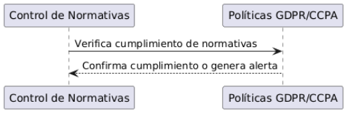

**UNIVERSIDAD PRIVADA DE TACNA**

**FACULTAD DE INGENIERÍA**

**Escuela Profesional de Ingeniería de Sistemas**

` `***Apis y Funciones***

Curso: *Tópicos de Base de Datos Avanzados I*

Docente: *Mag. Patrick Cuadros Quiroga*

Integrantes:

***Meza Noallca, Jean Marco			 	 (2021069823)***

***Castañeda Centurion, Jorge Enrique		           (2021069822)***

**Tacna – Perú**

***2024***

**Apis y Funciones**

**Documento de Especificación de Requerimientos de Software**

**Versión *2.0***

|CONTROL DE VERSIONES||||||
| :-: | :- | :- | :- | :- | :- |
|Versión|Hecha por|Revisada por|Aprobada por|Fecha|Motivo|
|1\.0|JM|JM|JM|12/12/2024|Versión Final|

**ÍNDICE GENERAL**

[1. Nombre de la Empresa: Universidad Privada de Tacna	](#_heading=h.n5r2i7oges9a)

[2. Visión	](#_heading=h.w4i0iqhjw13r)

[3. Misión	](#_heading=h.huh2uegp6qah)

[4. Organigrama	](#_heading=h.idfj3lnuufqx)

[1. Descripción del Problema	](#_heading=h.ijnspvpxvmid)

[2. Objetivos de Negocios	](#_heading=h.xtdjj9kwhnh1)

[3. Objetivos de Diseño	](#_heading=h.sqx7b5ezekln)

[4. Alcance del proyecto	](#_heading=h.v7x8dp36o7cr)

[5. Viabilidad del sistema	](#_heading=h.54e9xegmbfyq)

[a) Diagrama del Proceso Propuesto - Diagrama de actividades Inicial	](#_heading=h.5dw212rxu7w3)

[a) Cuadro de Requerimientos No Funcionales	](#_heading=h.n61rreioyjpj)

[b) Cuadro de Requerimientos Funcionales Final	](#_heading=h.izpypofjxqsz)

[c) Reglas de Negocio	](#_heading=h.nwoyzw5r3zir)

[1. Perfiles de Usuario	](#_heading=h.3ol5memz0zmq)

[2. Modelo Conceptual	](#_heading=h.6tr8ic3h4j0t)

[a) Diagrama de Paquetes	](#_heading=h.e85hwu93x7g4)

[b) Diagrama de Casos de Uso	](#_heading=h.6raqiy3yot0)

[c) Escenarios de Caso de Uso (narrativa)	](#_heading=h.gc4jh2gk8wzo)

[3. Modelo Lógico	](#_heading=h.gtf0zod51nsi)

[a) Diagrama de Actividades con Objetos	](#_heading=h.ahq98dydm0y2)

[b) Diagrama de Secuencia	](#_heading=h.qg8yridgt9dv)

[c) Diagrama de Clases	](#_heading=h.muzwxzgi2x5k)

**Documento de Especificación de Requerimientos de Software**

Introducción

Este documento de especificación de requerimientos de software tiene como objetivo detallar los aspectos fundamentales para el desarrollo e implementación de un sistema tecnológico que permita a la empresa gestionar de manera eficiente sus productos, usuarios y procesos internos. En este contexto, se busca optimizar la interacción con los usuarios y centralizar la información en un sistema robusto y accesible desde múltiples plataformas, mejorando la productividad y la experiencia del cliente.

El sistema propuesto deberá satisfacer las necesidades de los usuarios finales, integrándose con las plataformas existentes y asegurando la escalabilidad, seguridad y confiabilidad de la solución. Además, se brindará un enfoque integral al diseño y desarrollo del sistema, teniendo en cuenta tanto los aspectos técnicos como los operativos y económicos, para garantizar su viabilidad a largo plazo. Este documento está estructurado para proporcionar una visión clara de los objetivos, los requisitos y las soluciones necesarias, permitiendo una correcta implementación y alineación con los intereses del negocio y las expectativas de los usuarios.

1. Generalidades de la Empresa
1. ## **Nombre de la Empresa:** Universidad Privada de Tacna

1. ## **Visión**
   La visión de la empresa es convertirse en líder en el desarrollo de soluciones tecnológicas innovadoras que optimicen los procesos empresariales de nuestros clientes mediante el uso de herramientas modernas y eficientes.

1. ## **Misión**
   La misión de la empresa es ofrecer productos y servicios tecnológicos de alta calidad que ayuden a las empresas a transformar sus operaciones y alcanzar sus objetivos estratégicos mediante soluciones personalizadas y escalables.

	
1. ## **Organigrama**
   

II. Visionamiento de la Empresa:
1. ## **Descripción del Problema**
   La empresa enfrenta el desafío de mejorar la gestión de procesos internos, especialmente en la administración de productos y en la comunicación con los usuarios. Existe una necesidad de desarrollar un sistema eficiente que centralice la información y optimice la interacción con los usuarios, mejorando la experiencia del cliente y la productividad interna.

1. ## **Objetivos de Negocios**	
- Mejorar la eficiencia en la gestión de productos, almacenaje y ventas.
- Optimizar la experiencia del cliente mediante la digitalización de procesos.
- Reducir los tiempos de respuesta y mejorar la comunicación con los usuarios.

1. ## **Objetivos de Diseño**
- Desarrollar una interfaz de usuario intuitiva y fácil de usar.
- Asegurar la escalabilidad del sistema para adaptarse al crecimiento de la empresa.
- Integrar el sistema con plataformas existentes como bases de datos y aplicaciones de terceros.
- Garantizar la seguridad y protección de los datos de los usuarios.

1. ## **Alcance del proyecto**
**Inclusiones:**

- Desarrollo de un sistema de gestión de productos con base de datos centralizada.
- Interfaz de usuario accesible desde dispositivos móviles y de escritorio.
- Funcionalidades de gestión de inventarios, ventas y reportes.
- Integración con servicios de terceros (por ejemplo, pasarelas de pago, API de terceros).
- Módulo de autenticación de usuarios.

**Exclusiones:**

- Desarrollo de aplicaciones móviles específicas para cada plataforma (iOS y Android), aunque la interfaz será accesible desde dispositivos móviles.
- Soporte para idiomas adicionales fuera del español e inglés en una fase inicial.

1. ## **Viabilidad del sistema**
   1. Viabilidad Técnica

**Hardware Disponible**

- Servidores con capacidad para manejar grandes volúmenes de datos.
- Dispositivos móviles y de escritorio para los usuarios.
- Infraestructura para alojar bases de datos y aplicaciones (como servidores locales o en la nube)

**Equipos de desarrollo**

- Desarrolladores con experiencia en python, y MongoDB
- Administradores de base de datos para gestionar la infraestructura de datos.

**Software**

- Herramientas de desarrollo: Visual Studio Code, MongoDB, Python.
- Sistemas operativos: Linux, Windows, macOS**.**

**Aplicaciones y Herramientas de Desarrollo**

- Python para el backend y gestión de bases de datos.
- Flutter para la creación de la aplicación móvil.
- Herramientas de integración de API para el acceso a servicios externos.

**Navegadores Web**

- Compatible con los navegadores más utilizados: Google Chrome, Mozilla Firefox, Microsoft Edge.

  1. ` `Viabilidad Operativa
- **Beneficios para los Usuarios**:

  El proyecto ofrecerá una plataforma segura y eficiente para gestionar la autenticación y autorización de usuarios, mejorando la experiencia de acceso a los recursos internos. Al integrar Azure AD, los usuarios podrán acceder de manera centralizada a los servicios, evitando la necesidad de manejar credenciales duplicadas y mejorando la seguridad general.

**Beneficios clave para los usuarios incluyen**:

1. **Acceso seguro y centralizado**: Los usuarios podrán acceder a los sistemas internos de manera más segura mediante la autenticación integrada con Azure AD, lo que reduce los riesgos asociados con el manejo de credenciales múltiples.

1. **Gestión eficiente de permisos**: Gracias al modelo RBAC, los usuarios tendrán acceso solo a los recursos permitidos según su rol, lo que facilita la gestión de permisos y mejora la seguridad al evitar accesos no autorizados.

1. **Rendimiento mejorado**: Con la integración de MongoDB como base de datos, las consultas y operaciones relacionadas con los usuarios y roles serán rápidas y eficientes, garantizando tiempos de respuesta bajos y un sistema más ágil.

1. **Cumplimiento de normativas**: El sistema también garantizará que los datos personales estén protegidos y se cumpla con normativas internacionales como GDPR o CCPA, lo que generará mayor confianza entre los usuarios.

1. **Escalabilidad y portabilidad**: Gracias al uso de contenedores Docker, el sistema será fácil de escalar y trasladar entre entornos, lo que proporcionará flexibilidad para adaptarse a futuros cambios y mejoras.

III. [Análisis de Procesos](https://docs.google.com/document/d/1kzyTY_VoV_pDJ15dD-avtakwMccfG6fT/edit#heading=h.30j0zll)
1) ## **Diagrama del Proceso Propuesto - Diagrama de actividades Inicial**
   

*Diagrama 01:Este diagrama proporciona una vista clara del flujo del sistema, destacando las responsabilidades y las interacciones entre los usuarios y el sistema. Esto permite identificar puntos clave de interacción y garantizar que cada funcionalidad esté correctamente implementada en el sistema.*

IV. Especificación de Requerimientos de Software
1) ## **Cuadro de Requerimientos No Funcionales**

|**Código**|**Requerimiento**|**Descripción**|
| :-: | :-: | :-: |
|RF-01|Escalabilidad|El sistema debe ser capaz de soportar hasta 500 usuarios concurrentes sin pérdida de rendimiento.|
|RF-02|Disponibilidad|El sistema debe garantizar un tiempo de actividad del 99.5% o superior.|
|RF-03|Rendimiento	|Las solicitudes deben ser procesadas y respondidas en menos de 300 ms.|
|RF-04|Seguridad|El sistema debe seguir mejores prácticas de seguridad, incluyendo cifrado en tránsito y almacenamiento seguro de credenciales.|
|RF-05|Interoperabilidad|El sistema debe ser compatible e integrarse correctamente con Azure AD y MongoDB Atlas.|
|RF-06|Mantenibilidad|El sistema debe ser fácil de mantener y actualizar, y debe contar con documentación técnica adecuada.|
|RF-07|Portabilidad|El sistema debe ser fácilmente portable entre diferentes entornos gracias a Docker.|
|RF-08|Cumplimiento de Estándares Legales|El sistema debe cumplir con las normativas legales de protección de datos, como GDPR, CCPA, y otras leyes relevantes.|
|RF-09|Usabilidad|El sistema debe tener interfaces intuitivas y fáciles de usar tanto para administradores como para usuarios generales.|
|RF-10|Compatibilidad|El sistema debe ser compatible con diferentes navegadores y dispositivos, accesible tanto desde web como aplicaciones cliente.|
|RF-11|Resiliencia|El sistema debe ser resiliente frente a fallos, con mecanismos de recuperación rápida ante desastres o fallos inesperados.|

1) ## **Cuadro de Requerimientos Funcionales Final**

|**Código**|**Requerimiento**|**Descripción**|
| :-: | :-: | :-: |
|RF-01|Autenticación con Azure AD	|El sistema debe autenticar a los usuarios utilizando Azure Active Directory (Azure AD).|
|RF-02|Gestión de Roles (RBAC)	|Los administradores deben poder definir y asignar roles a los usuarios, limitando el acceso a los recursos en función del rol.|
|RF-03|Gestión de Usuarios|El sistema debe permitir la creación, edición y eliminación de usuarios, así como la asignación o modificación de roles.|
|RF-04|Base de Datos MongoDB	|El sistema debe almacenar la información de usuarios y roles de forma segura en una base de datos MongoDB Atlas.|
|RF-05|Interfaz de Administración|Los administradores deben poder gestionar usuarios y roles, y visualizar logs de actividad mediante una interfaz fácil de usar.|
|RF-06|Protocolos de Seguridad	|El sistema debe asegurar la protección de comunicaciones con TLS y el almacenamiento seguro de credenciales y claves.|
|RF-07|Escalabilidad y Despliegue|El sistema debe ser escalable horizontalmente mediante Kubernetes y contener su despliegue en contenedores Docker.|
|RF-08|Cumplimiento Normativo|El sistema debe cumplir con las normativas de protección de datos, como GDPR y CCPA, para asegurar la privacidad de los usuarios.|
|RF-09|Auditorías y Monitoreo|El sistema debe registrar y monitorear todos los accesos y actividades de los usuarios para detectar posibles brechas de seguridad.|
|RF-10|Respaldo y Recuperación|El sistema debe permitir respaldos periódicos y recuperación de datos en caso de desastre.|

1) ## **Reglas de Negocio**

|Nombre|Descripción|Autoridad|
| :- | :- | :- |
|Autenticación|Solo los usuarios autenticados mediante Azure Active Directory (Azure AD) pueden acceder al sistema.	|Administrador de Seguridad|
|Acceso por roles (RBAC)|Los usuarios solo pueden acceder a los recursos y funcionalidades del sistema según su rol asignado.	|Administrador de Roles|
|Creacion de usuarios|Solo los administradores pueden crear, editar o eliminar usuarios.	|Administrador del Sistema|
|Asignación de roles|||
||Solo los administradores pueden asignar o modificar los roles de los usuarios.	|Administrador de Roles|
| - | - | :-: |
|Seguridad de Contraseñas|Las contraseñas deben cumplir con un mínimo de 8 caracteres y contener al menos un número, una letra mayúscula y un carácter especial.	|Administrador de Seguridad|
|Acceso a la Base de Datos|El acceso a la base de datos debe ser restringido a usuarios autorizados y protegido mediante cifrado de datos en tránsito.	|Administrador de Base de Datos|
|Auditoría de Actividades|Todas las actividades de los usuarios deben ser registradas para generar auditorías que puedan ser revisadas por el administrador.	|Administrador de Seguridad|
|Control de Errores|Los errores del sistema deben ser manejados de manera que no expongan información sensible a los usuarios.|Desarrollador del Sistema|
|Cumplimiento Normativo|El sistema debe cumplir con las regulaciones de privacidad y protección de datos, como GDPR y CCPA.|Administrador de Cumplimiento Normativo|
|Respaldo de Datos|Los datos del sistema deben ser respaldados automáticamente cada 24 horas para garantizar la recuperación ante fallos.|Administrador de Infraestructura|
|Disponibilidad|El sistema debe estar disponible un 99.5% del tiempo, con tiempos de inactividad planificados notificados a los usuarios.	|Administrador de Infraestructura|
|Mantenimiento de Sistema|Las actualizaciones del sistema deben realizarse fuera del horario pico para minimizar el impacto a los usuarios.|Administrador de Infraestructura|
|Integridad de Datos|Todos los datos almacenados deben ser validados antes de ser ingresados en la base de datos para evitar registros incorrectos.|Desarrollador de Base de Datos|
|Control de Acceso a Logs|Solo los administradores tienen acceso completo a los logs del sistema, mientras que los usuarios regulares tienen acceso limitado.|Administrador de Seguridad|
|Notificación de Eventos|Los administradores deben recibir notificaciones de eventos críticos, como intentos fallidos de inicio de sesión o accesos no autorizados.|Administrador de Seguridad|
|Performance|El sistema debe responder a todas las solicitudes en un máximo de 300 ms, garantizando una experiencia de usuario fluida.|Administrador de Infraestructura|
|Actualización de Roles|Los roles deben ser revisados y actualizados trimestralmente para asegurar que se mantengan adecuados a las necesidades del sistema.|Administrador de Roles|

V. Fases de Desarrollo
1. ## **Perfiles de Usuario**
- Administrador

  El administrador es el usuario con mayores privilegios dentro del sistema. Tiene el control total sobre todas las funcionalidades, incluyendo la creación, edición y eliminación de usuarios, así como la asignación de roles y permisos. También es responsable de la configuración y gestión de los eventos relacionados con los juegos florales, definiendo categorías, fechas y detalles de los mismos. Además, supervisa el sistema mediante la visualización de logs e informes de actividad, y se asegura de que las políticas de acceso y seguridad sean correctamente implementadas.

- Usuario

  El usuario es un participante registrado en la plataforma. Este perfil tiene un acceso limitado pero significativo, ya que puede inscribirse en eventos de juegos florales, consultar resultados y estadísticas de sus participaciones, y gestionar su perfil personal. Los usuarios interactúan directamente con los juegos florales y participan en las diferentes categorías según su interés. Aunque no tienen acceso a configuraciones del sistema ni a funcionalidades de administración, su experiencia es central para el propósito del sistema.

- Cliente

  El cliente o visitante es un usuario no registrado que puede explorar el contenido público del sistema. Su interacción se limita a la visualización de información básica sobre los eventos de juegos florales, como las categorías, las fechas y las ubicaciones. Este perfil no puede realizar inscripciones ni acceder a funcionalidades avanzadas del sistema, pero cumple con el objetivo de proporcionar información accesible al público general y fomentar el interés en los juegos florales.

- Soporte

  El perfil de soporte está dedicado a ofrecer asistencia a los usuarios del sistema. Este rol es fundamental para resolver problemas relacionados con inscripciones, consultas sobre resultados, o cualquier inconveniente técnico que puedan enfrentar los usuarios. Los usuarios de soporte tienen acceso a información básica de los participantes (sin incluir datos sensibles) y pueden gestionar incidencias, responder preguntas frecuentes, y ofrecer ayuda personalizada. No tienen acceso a configuraciones del sistema ni a funciones administrativas.

1. ## **Modelo Conceptual**
1) ### Diagrama de Paquetes
   Diagrama de Paquetes del API

      

1) ### Diagrama de Casos de Uso
   Diagrama de Casos de Uso de la Plataforma

      

1) ### Escenarios de Caso de Uso (narrativa)
- *Narrativa de CU01 “Autenticación con Azure AD”*
<table><tr><th colspan="1" valign="top"><b>Caso de Uso</b></th><th colspan="1" valign="top">Autenticación con Azure AD</th><th colspan="1" valign="top"><b>CU01</b></th></tr>
<tr><td colspan="1" valign="top"><b>Actores</b></td><td colspan="2" valign="top">Usuario</td></tr>
<tr><td colspan="1" valign="top"><b>Descripción</b></td><td colspan="2" valign="top">El usuario intenta iniciar sesión utilizando su cuenta de Azure AD.	</td></tr>
<tr><td colspan="1" valign="top"><b>Precondiciones</b></td><td colspan="2" valign="top">El usuario debe tener una cuenta registrada en Azure AD.	</td></tr>
<tr><td colspan="1" rowspan="5"><b>FLUJO NORMAL</b></td><td colspan="2" valign="top"><b>Acción: Autenticar credenciales</b></td></tr>
<tr><td colspan="1" valign="top"><b>ACCIÓN DEL ACTOR</b></td><td colspan="1" valign="top"><b>CURSO DEL SISTEMA</b></td></tr>
<tr><td colspan="1" valign="top">1\. El usuario ingresa su usuario y contraseña en la página de inicio de sesión.</td><td colspan="1" valign="top">2\. El sistema verifica las credenciales en Azure AD.</td></tr>
<tr><td colspan="1" valign="top">3\. El usuario obtiene acceso a la plataforma.</td><td colspan="1" valign="top">4\. Si las credenciales son incorrectas, el sistema solicita nuevamente las credenciales o muestra un mensaje de error.</td></tr>
<tr><td colspan="1" valign="top">5\. El usuario ha iniciado sesión correctamente y accede a su perfil.</td><td colspan="1" valign="top"></td></tr>
</table>
- *Narrativa de CU02 “Gestión de Roles (RBAC)”*
<table><tr><th colspan="1" valign="top"><b>Caso de Uso</b></th><th colspan="1" valign="top">Gestión de Roles (RBAC)</th><th colspan="1" valign="top"><b>CU02</b></th></tr>
<tr><td colspan="1" valign="top"><b>Actores</b></td><td colspan="2" valign="top">Administrador</td></tr>
<tr><td colspan="1" valign="top"><b>Descripción</b></td><td colspan="2" valign="top">El administrador asigna un rol a un usuario.	</td></tr>
<tr><td colspan="1" valign="top"><b>Precondiciones</b></td><td colspan="2" valign="top">El administrador debe estar autenticado y debe tener acceso a la gestión de roles.	</td></tr>
<tr><td colspan="1" rowspan="5"><b>FLUJO NORMAL</b></td><td colspan="2" valign="top"><b>Acción: Gestionar roles</b></td></tr>
<tr><td colspan="1" valign="top"><b>ACCIÓN DEL ACTOR</b></td><td colspan="1" valign="top"><b>CURSO DEL SISTEMA</b></td></tr>
<tr><td colspan="1" valign="top">1\. El administrador selecciona el usuario al que desea asignar un rol.</td><td colspan="1" valign="top"></td></tr>
<tr><td colspan="1" valign="top">2\. El administrador elige el rol deseado.</td><td colspan="1" valign="top">3\. El sistema actualiza el rol del usuario.</td></tr>
<tr><td colspan="1" valign="top"></td><td colspan="1" valign="top">4\. Si el rol no se asigna correctamente, el sistema muestra un mensaje de error.</td></tr>
</table>

- *Narrativa de CU03 “Gestión de Usuarios”*
<table><tr><th colspan="1" valign="top"><b>Caso de Uso</b></th><th colspan="1" valign="top">Gestión de Usuarios</th><th colspan="1" valign="top"><b>CU03</b></th></tr>
<tr><td colspan="1" valign="top"><b>Actores</b></td><td colspan="2" valign="top">Administrador</td></tr>
<tr><td colspan="1" valign="top"><b>Descripción</b></td><td colspan="2" valign="top">El administrador crea un nuevo usuario en el sistema.	</td></tr>
<tr><td colspan="1" valign="top"><b>Precondiciones</b></td><td colspan="2" valign="top">El administrador debe tener permisos para gestionar usuarios.	</td></tr>
<tr><td colspan="1" rowspan="5"><b>FLUJO NORMAL</b></td><td colspan="2" valign="top"><b>Acción: Consultar estadísticas académicas</b></td></tr>
<tr><td colspan="1" valign="top"><b>ACCIÓN DEL ACTOR</b></td><td colspan="1" valign="top"><b>CURSO DEL SISTEMA</b></td></tr>
<tr><td colspan="1" valign="top">1\. El administrador ingresa los datos del nuevo usuario.</td><td colspan="1" valign="top">2\. El sistema valida los datos.</td></tr>
<tr><td colspan="1" valign="top"></td><td colspan="1" valign="top">3\. El usuario es creado con los roles asignados.</td></tr>
<tr><td colspan="1" valign="top"></td><td colspan="1" valign="top">4\. Si los datos son incorrectos, el sistema muestra un mensaje de error.</td></tr>
</table>

- *Narrativa de CU04 “Base de Datos MongoDB”*
<table><tr><th colspan="1" valign="top"><b>Caso de Uso</b></th><th colspan="1" valign="top">Base de Datos MongoDB</th><th colspan="1" valign="top"><b>CU04</b></th></tr>
<tr><td colspan="1" valign="top"><b>Actores</b></td><td colspan="2" valign="top">Sistema	</td></tr>
<tr><td colspan="1" valign="top"><b>Descripción</b></td><td colspan="2" valign="top">El sistema guarda la información de los usuarios en MongoDB.	</td></tr>
<tr><td colspan="1" valign="top"><b>Precondiciones</b></td><td colspan="2" valign="top">El sistema debe estar conectado a la base de datos MongoDB.	</td></tr>
<tr><td colspan="1" rowspan="5"><b>FLUJO NORMAL</b></td><td colspan="2" valign="top"><b>Acción: Almacenar datos</b></td></tr>
<tr><td colspan="1" valign="top"><b>ACCIÓN DEL ACTOR</b></td><td colspan="1" valign="top"><b>CURSO DEL SISTEMA</b></td></tr>
<tr><td colspan="1" valign="top"></td><td colspan="1" valign="top">1\. El sistema recibe los datos del usuario.</td></tr>
<tr><td colspan="1" valign="top"></td><td colspan="1" valign="top">2\. Los datos son validados y almacenados en MongoDB.</td></tr>
<tr><td colspan="1" valign="top"></td><td colspan="1" valign="top">3\. Si la base de datos está caída, el sistema muestra un mensaje de error.</td></tr>
</table>

- *Narrativa de CU05 “Interfaz de Administración”*
<table><tr><th colspan="1" valign="top"><b>Caso de Uso</b></th><th colspan="1" valign="top">Interfaz de Administración</th><th colspan="1" valign="top"><b>CU05</b></th></tr>
<tr><td colspan="1" valign="top"><b>Actores</b></td><td colspan="2" valign="top">Administrador	</td></tr>
<tr><td colspan="1" valign="top"><b>Descripción</b></td><td colspan="2" valign="top">El administrador gestiona usuarios a través de la interfaz de administración.</td></tr>
<tr><td colspan="1" valign="top"><b>Precondiciones</b></td><td colspan="2" valign="top">El administrador debe estar autenticado y tener acceso a la interfaz de administración.</td></tr>
<tr><td colspan="1" rowspan="5"><b>FLUJO NORMAL</b></td><td colspan="2" valign="top"><b>Acción: Uso de la interfaz de administracion</b></td></tr>
<tr><td colspan="1" valign="top"><b>ACCIÓN DEL ACTOR</b></td><td colspan="1" valign="top"><b>CURSO DEL SISTEMA</b></td></tr>
<tr><td colspan="1" valign="top">1. El administrador accede a la interfaz de administración.</td><td colspan="1" valign="top"></td></tr>
<tr><td colspan="1" valign="top">2. El administrador selecciona la opción de gestionar usuarios.</td><td colspan="1" valign="top">3. El sistema muestra la lista de usuarios.</td></tr>
<tr><td colspan="1" valign="top">4. El administrador puede crear, editar o eliminar usuarios.</td><td colspan="1" valign="top">5. Si el administrador no tiene permisos, el sistema muestra un mensaje de acceso denegado.</td></tr>
</table>

- *Narrativa de CU06 “Protocolos de Seguridad”*
<table><tr><th colspan="1" valign="top"><b>Caso de Uso</b></th><th colspan="1" valign="top">Protocolos de Seguridad</th><th colspan="1" valign="top"><b>CU06</b></th></tr>
<tr><td colspan="1" valign="top"><b>Actores</b></td><td colspan="2" valign="top">Sistema	</td></tr>
<tr><td colspan="1" valign="top"><b>Descripción</b></td><td colspan="2" valign="top">El sistema protege las comunicaciones mediante TLS.	</td></tr>
<tr><td colspan="1" valign="top"><b>Precondiciones</b></td><td colspan="2" valign="top">El sistema debe tener configurado TLS.	</td></tr>
<tr><td colspan="1" rowspan="5"><b>FLUJO NORMAL</b></td><td colspan="2" valign="top"><b>Acción: Comunicación TLS</b></td></tr>
<tr><td colspan="1" valign="top"><b>ACCIÓN DEL ACTOR</b></td><td colspan="1" valign="top"><b>CURSO DEL SISTEMA</b></td></tr>
<tr><td colspan="1" valign="top">1. El usuario establece una conexión con el sistema.</td><td colspan="1" valign="top">2. El sistema inicia la comunicación segura usando TLS.</td></tr>
<tr><td colspan="1" valign="top"></td><td colspan="1" valign="top">3. Los datos son transferidos de forma segura.</td></tr>
<tr><td colspan="1" valign="top"></td><td colspan="1" valign="top">4. Si TLS no está configurado, el sistema no permite la conexión o muestra un mensaje de error.</td></tr>
</table>
- *Narrativa de CU07 “Escalabilidad y Despliegue”*
<table><tr><th colspan="1" valign="top"><b>Caso de Uso</b></th><th colspan="1" valign="top">Escalabilidad y Despliegue</th><th colspan="1" valign="top"><b>CU07</b></th></tr>
<tr><td colspan="1" valign="top"><b>Actores</b></td><td colspan="2" valign="top">Sistema	</td></tr>
<tr><td colspan="1" valign="top"><b>Descripción</b></td><td colspan="2" valign="top">El sistema escala sus recursos horizontalmente mediante Kubernetes.	</td></tr>
<tr><td colspan="1" valign="top"><b>Precondiciones</b></td><td colspan="2" valign="top">El sistema debe estar configurado para utilizar Kubernetes.	</td></tr>
<tr><td colspan="1" rowspan="5"><b>FLUJO NORMAL</b></td><td colspan="2" valign="top"><b>Acción: Escala de recursos</b></td></tr>
<tr><td colspan="1" valign="top"><b>ACCIÓN DEL ACTOR</b></td><td colspan="1" valign="top"><b>CURSO DEL SISTEMA</b></td></tr>
<tr><td colspan="1" valign="top"></td><td colspan="1" valign="top">1. El sistema detecta que hay alta demanda de recursos.</td></tr>
<tr><td colspan="1" valign="top"></td><td colspan="1" valign="top">2. Kubernetes aumenta el número de réplicas de contenedores Docker.</td></tr>
<tr><td colspan="1" valign="top"></td><td colspan="1" valign="top">3. El sistema sigue funcionando sin interrupciones.</td></tr>
</table>

- *Narrativa de CU08 “Cumplimiento Normativo”*
<table><tr><th colspan="1" valign="top"><b>Caso de Uso</b></th><th colspan="1" valign="top">Cumplimiento Normativo</th><th colspan="1" valign="top"><b>CU08</b></th></tr>
<tr><td colspan="1" valign="top"><b>Actores</b></td><td colspan="2" valign="top">Sistema	</td></tr>
<tr><td colspan="1" valign="top"><b>Descripción</b></td><td colspan="2" valign="top">El sistema asegura que se cumple con las normativas de privacidad.	</td></tr>
<tr><td colspan="1" valign="top"><b>Precondiciones</b></td><td colspan="2" valign="top">El sistema debe estar configurado para cumplir con las normativas GDPR y CCPA.	</td></tr>
<tr><td colspan="1" rowspan="5"><b>FLUJO NORMAL</b></td><td colspan="2" valign="top"><b>Acción: Escala de recursos</b></td></tr>
<tr><td colspan="1" valign="top"><b>ACCIÓN DEL ACTOR</b></td><td colspan="1" valign="top"><b>CURSO DEL SISTEMA</b></td></tr>
<tr><td colspan="1" valign="top"></td><td colspan="1" valign="top">1. El sistema recaba los datos personales de los usuarios.</td></tr>
<tr><td colspan="1" valign="top"></td><td colspan="1" valign="top">2. El sistema informa sobre el uso de datos y solicita consentimiento.</td></tr>
<tr><td colspan="1" valign="top"></td><td colspan="1" valign="top">3. Los datos son procesados conforme a las normativas.</td></tr>
</table>
- *Narrativa de CU09 “Auditorías y Monitoreo”*
<table><tr><th colspan="1" valign="top"><b>Caso de Uso</b></th><th colspan="1" valign="top">Auditorías y Monitoreo</th><th colspan="1" valign="top"><b>CU09</b></th></tr>
<tr><td colspan="1" valign="top"><b>Actores</b></td><td colspan="2" valign="top">Sistema	</td></tr>
<tr><td colspan="1" valign="top"><b>Descripción</b></td><td colspan="2" valign="top">El sistema monitorea las actividades de los usuarios.	</td></tr>
<tr><td colspan="1" valign="top"><b>Precondiciones</b></td><td colspan="2" valign="top">El sistema debe tener habilitado el registro de actividad.	</td></tr>
<tr><td colspan="1" rowspan="5"><b>FLUJO NORMAL</b></td><td colspan="2" valign="top"><b>Acción: Escala de recursos</b></td></tr>
<tr><td colspan="1" valign="top"><b>ACCIÓN DEL ACTOR</b></td><td colspan="1" valign="top"><b>CURSO DEL SISTEMA</b></td></tr>
<tr><td colspan="1" valign="top"></td><td colspan="1" valign="top">1. El sistema registra las acciones de los usuarios (inicio de sesión, cambios, etc.).</td></tr>
<tr><td colspan="1" valign="top"></td><td colspan="1" valign="top">2. Los registros son almacenados y monitoreados para detectar comportamientos sospechosos.</td></tr>
<tr><td colspan="1" valign="top"></td><td colspan="1" valign="top">3. Si se detecta una actividad sospechosa, el sistema envía una alerta a los administradores.</td></tr>
</table>
- *Narrativa de CU10 “Respaldo de Datos”*
<table><tr><th colspan="1" valign="top"><b>Caso de Uso</b></th><th colspan="1" valign="top">Respaldo de Datos</th><th colspan="1" valign="top"><b>CU10</b></th></tr>
<tr><td colspan="1" valign="top"><b>Actores</b></td><td colspan="2" valign="top">Sistema	</td></tr>
<tr><td colspan="1" valign="top"><b>Descripción</b></td><td colspan="2" valign="top">El sistema realiza un respaldo periódico de los datos almacenados.	</td></tr>
<tr><td colspan="1" valign="top"><b>Precondiciones</b></td><td colspan="2" valign="top">El sistema debe tener habilitada la funcionalidad de respaldo automático.	</td></tr>
<tr><td colspan="1" rowspan="6"><b>FLUJO NORMAL</b></td><td colspan="2" valign="top"><b>Acción: Escala de recursos</b></td></tr>
<tr><td colspan="1" valign="top"><b>ACCIÓN DEL ACTOR</b></td><td colspan="1" valign="top"><b>CURSO DEL SISTEMA</b></td></tr>
<tr><td colspan="1" valign="top"></td><td colspan="1" valign="top">1. El sistema programa un respaldo periódico (diario, semanal, etc.).</td></tr>
<tr><td colspan="1" valign="top"></td><td colspan="1" valign="top">2. El sistema copia los datos almacenados en un repositorio de respaldo.</td></tr>
<tr><td colspan="1" valign="top"></td><td colspan="1" valign="top">3. El respaldo se confirma correctamente.	</td></tr>
<tr><td colspan="1" valign="top"></td><td colspan="1" valign="top">4. Si el respaldo falla, el sistema envía una alerta a los administradores e intenta realizar el respaldo nuevamente.</td></tr>
</table>

1. ## **Modelo Lógico**
1) ### **Diagrama de Actividades con Objetos**
Diagrama de Actividades CU-01 “Autenticación con Azure AD”

   

Diagrama de Actividades CU-02 “Gestión de Roles (RBAC)”

   

Diagrama de Actividades CU-03 “Gestión de Usuarios”

   

Diagrama de Actividades CU-04 “Base de Datos MongoDB”

   

Diagrama de Actividades CU-05 “Interfaz de Administración”

   

Diagrama de Actividades CU-06 “Protocolos de Seguridad”

   

Diagrama de Actividades CU-07 “Escalabilidad y Despliegue”

   

Diagrama de Actividades CU-08 “Cumplimiento Normativo”

   

Diagrama de Actividades CU-09 “Auditorías y Monitoreo”

   

Diagrama de Actividades CU-10 “Respaldo y Recuperación”

   

1) ### **Diagrama de Secuencia** 
Diagrama de Secuencia de CU01 “Autenticación con Azure AD”

   

Diagrama de Secuencia de CU02 “Gestión de Roles (RBAC)”

   

Diagrama de Secuencia de CU03 “Gestión de Usuarios”

   

Diagrama de Secuencia de CU04 “Base de Datos MongoDB”

   

Diagrama de Secuencia de CU05 “Interfaz de Administración”

   

Diagrama de Secuencia de CU06 “Protocolos de Seguridad”

   

Diagrama de Secuencia de CU07 “Escalabilidad y Despliegue”

   

Diagrama de Secuencia de CU08 “Cumplimiento Normativo”

   

Diagrama de Secuencia de CU09 “Auditorías y Monitoreo”

   

Diagrama de Secuencia de CU10 “Respaldo y Recuperación”

   
1) ###  **Diagrama de Clases**
   

**Conclusiones**

El desarrollo de este sistema tecnológico para la Universidad Privada de Tacna representa un paso significativo hacia la modernización y optimización de los procesos internos, además de mejorar la experiencia de los usuarios finales. La integración de tecnologías avanzadas, como Azure Active Directory para la autenticación, MongoDB como base de datos robusta, y el uso de contenedores Docker para garantizar la escalabilidad y portabilidad, asegura que el sistema cumpla con los estándares actuales de desarrollo de software.

El análisis detallado de los requerimientos funcionales y no funcionales ha permitido identificar las necesidades clave de los usuarios, asegurando que el sistema ofrezca funcionalidades críticas como la gestión de usuarios y roles, auditorías de actividad, respaldo y recuperación de datos, y cumplimiento normativo. La implementación de un enfoque modular y escalable, respaldado por un diseño centrado en la seguridad y la experiencia del usuario, garantiza que el sistema será capaz de adaptarse al crecimiento futuro de la universidad.

En términos operativos, el sistema proporciona herramientas que centralizan y automatizan procesos previamente manuales, mejorando la eficiencia y reduciendo el margen de error. Además, el enfoque integral que incluye aspectos técnicos, económicos y operativos asegura la viabilidad del proyecto a largo plazo, alineándose con los objetivos estratégicos de la universidad.

**Recomendaciones**

- Capacitación del personal: Asegurar que los usuarios administrativos y técnicos reciben formación para el uso eficiente del sistema.
- Monitoreo Regular: Realizar auditorías y revisiones periódicas para garantizar el desempeño y la seguridad del sistema.
- Escalabilidad: Adaptar la infraestructura a medida que aumente la carga de usuarios y datos.
- Cumplimiento Normativo: Revisar y ajustar el sistema regularmente para cumplir con normativas como GDPR y CCPA.
- Feedback del Usuario: Implementar mecanismos para recopilar sugerencias y mejorar la experiencia de los usuarios.
- Pruebas de Seguridad: Realizar pruebas regulares para identificar y solucionar vulnerabilidades.
- Actualización del Sistema: Mantener las tecnologías involucradas al día para garantizar compatibilidad y seguridad.