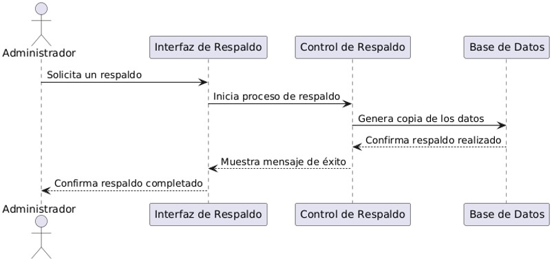
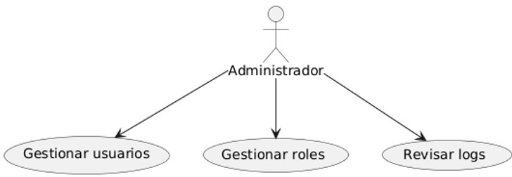

**UNIVERSIDAD PRIVADA DE TACNA**

**FACULTAD DE INGENIERÍA**

**Escuela Profesional de Ingeniería de Sistemas**

` `***Apis y Funciones***

Curso: *Tópicos de Base de Datos Avanzados I*

Docente: *Mag. Patrick Cuadros Quiroga*

Integrantes:

***Meza Noallca, Jean Marco			 	 (2021069823)***

***Castañeda Centurion, Jorge Enrique		           (2021069822)***

**Tacna – Perú**

***2024***

**Apis y Funciones**

**Documento de Arquitectura de Software**

**Versión *2.0***

|CONTROL DE VERSIONES||||||
| :-: | :- | :- | :- | :- | :- |
|Versión|Hecha por|Revisada por|Aprobada por|Fecha|Motivo|
|1\.0|JM|JM|JM|12/12/2024|Versión Original|

**ÍNDICE GENERAL**

[1.1. Propósito	](#_heading=h.tyrt0o4h0b84)

[1.2. Alcance	](#_heading=h.ozhpd5iokjj9)

[1.3. Definiciones, Siglas y Abreviaturas	](#_heading=h.qy1d5tbw4oca)

[1.4. Visión General	](#_heading=h.xi6gyrzgn00y)

[2.1. Escenarios	](#_heading=h.6qmc3bibwx3b)

[2.2. Vista Lógica	](#_heading=h.iakmpief1kj4)

[2.3. Vista del Proceso	](#_heading=h.2ixv07w881xw)

[2.4. Vista de desarrollo	](#_heading=h.jwt31wwxglhh)

[2.5. Vista Física	](#_heading=h.54ulqemo589y)

[3.1. Disponibilidad.	](#_heading=h.za4xoue7opcr)

[3.2. Seguridad	](#_heading=h.a6ip1nny093l)

[3.3. Adaptabilidad	](#_heading=h.8g6sznvlv17l)

[3.4. Rendimiento.	](#_heading=h.bhilnbm53cfx)

[4.1. Requerimientos funcionales	](#_heading=h.1p3kioc36xps)

[4.2. Requerimientos no funcionales	](#_heading=h.ubyuyd54w8e9)

[6.1. Diagrama Contextual	](#_heading=h.k7evy4rr86td)

[7.1. Diagrama de Proceso Propuesto	](#_heading=h.6g1cqsic498e)

[8.1. Diagrama de Contenedor	](#_heading=h.wawag9207tsb)

[9.1. Diagrama de Componentes	](#_heading=h.jh6b2h6sqrgq)

[10.1. Diagrama Entidad Relación	](#_heading=h.raf1w2k8e8u8)

[11.1. Escenario de Seguridad	](#_heading=h.d162a9cjbn4q)

[11.2. Escenario de Usabilidad	](#_heading=h.6zqdbo7slos1)

[11.3. Escenario de Adaptabilidad	](#_heading=h.uub91h65w2v6)

[11.4. Escenario de Disponibilidad	](#_heading=h.p6rv9blri01i)

[11.5. Otro Escenario	](#_heading=h.apr1nve6uxo3)

**Documento de Arquitectura de Software**

1. Introducción

   Este documento detalla la arquitectura técnica de la API diseñada para gestionar la autenticación y autorización de usuarios mediante Azure Active Directory (Azure AD). La solución tiene como objetivo ofrecer un sistema robusto y seguro para proteger los recursos de la aplicación, garantizando que solo los usuarios autorizados tengan acceso según sus permisos y roles.

   En un contexto donde la seguridad es un factor primordial, Azure AD proporciona una plataforma escalable y confiable para implementar la autenticación basada en identidades corporativas. Al integrar esta plataforma en la arquitectura de la API, se busca proporcionar una experiencia de usuario fluida y segura, asegurando que los accesos y permisos sean gestionados de manera eficiente.

   La API no solo implementará un proceso de autenticación, sino que también definirá un sistema de autorización a través del uso de Control de Acceso Basado en Roles (RBAC). Este sistema permitirá diferenciar los niveles de acceso de los usuarios según su rol, tales como administradores, usuarios generales u otros roles personalizados, con el fin de garantizar que cada usuario solo pueda acceder a las funcionalidades que le competen, según las políticas de seguridad definidas.

   Además, la API estará diseñada para facilitar la integración con otras aplicaciones y servicios, ofreciendo un punto único de gestión de usuarios y accesos que centraliza las políticas de seguridad, optimizando tanto el mantenimiento como la administración de los permisos.

   Este documento tiene como objetivo proporcionar una visión general de la arquitectura del sistema, las tecnologías utilizadas, y los componentes clave que hacen posible la implementación segura de la autenticación y autorización. A través de este enfoque, se pretende garantizar la integridad, disponibilidad y confidencialidad de los datos, así como la facilidad de escalabilidad de la solución en función de las necesidades futuras.

   1. ## **Propósito**
El proyecto tiene como propósito desarrollar una API segura y robusta que permita gestionar la autenticación y autorización de usuarios utilizando Azure Active Directory (Azure AD). La API implementará un control de acceso basado en roles (RBAC) para diferenciar los niveles de acceso de los usuarios, como administradores y usuarios generales, garantizando que cada uno acceda únicamente a las secciones correspondientes de la aplicación. El sistema se complementará con MongoDB como base de datos, donde se almacenará la información relacionada con los usuarios, sus roles y actividades. Esto permitirá gestionar de forma eficiente las operaciones y mantener un registro seguro de las interacciones. Se utilizarán prácticas modernas de desarrollo, como el despliegue en contenedores Docker, para garantizar portabilidad y escalabilidad, lo que facilita la implementación tanto en entornos de prueba como en producción.
1. ## **Alcance**
**Inclusiones:**

- Desarrollo de un sistema de gestión de productos con base de datos centralizada.
- Interfaz de usuario accesible desde dispositivos móviles y de escritorio.
- Funcionalidades de gestión de inventarios, ventas y reportes.
- Integración con servicios de terceros (por ejemplo, pasarelas de pago, API de terceros).
- Módulo de autenticación de usuarios.

**Exclusiones:**

- Desarrollo de aplicaciones móviles específicas para cada plataforma (iOS y Android), aunque la interfaz será accesible desde dispositivos móviles.
- Soporte para idiomas adicionales fuera del español e inglés en una fase inicial.
  1. ## **Definiciones, Siglas y Abreviaturas**
- **API**: Interfaz de Programación de Aplicaciones (Application Programming Interface).
- **Azure AD**: Azure Active Directory, sistema de autenticación en la nube de Microsoft.
- **RBAC**: Control de Acceso Basado en Roles (Role-Based Access Control).
- **MongoDB Atlas**: Servicio de base de datos NoSQL basado en la nube.
- **MSAL**: Microsoft Authentication Library, biblioteca para manejar autenticaciones con Azure AD.
- **TLS**: Seguridad en la capa de transporte (Transport Layer Security)
  1. ## **Visión General**
     El producto está diseñado para actuar como un puente seguro y eficiente entre Azure Active Directory (Azure AD) y MongoDB Atlas, ofreciendo una solución escalable para la gestión de usuarios y roles. Con un enfoque en la seguridad y la facilidad de uso, el sistema permite a las organizaciones centralizar procesos de autenticación y autorización, garantizando el cumplimiento de normativas internacionales de protección de datos.

     Su arquitectura escalable y su integración con Docker facilitan el despliegue en diferentes entornos, asegurando un rendimiento óptimo incluso con un crecimiento sostenido en el número de usuarios. Además, combina la robustez de Azure AD para la autenticación con el almacenamiento seguro y confiable de MongoDB, asegurando una experiencia eficiente tanto para administradores como para usuarios finales.

2. Representación Arquitectónica
   1. ## **Escenarios**
Diagrama de Casos de Uso de la Plataforma en PowerBi

1. ## **Vista Lógica**
Componentes

1. ## **Vista del Proceso**
Diagrama de Secuencia de CU01 “Autenticación con Azure AD”

Diagrama de Secuencia de CU02 “Gestión de Roles (RBAC)”

Diagrama de Secuencia de CU03 “Gestión de Usuarios”

Diagrama de Secuencia de CU04 “Base de Datos MongoDB”

Diagrama de Secuencia de CU05 “Interfaz de Administración”

Diagrama de Secuencia de CU06 “Protocolos de Seguridad”

Diagrama de Secuencia de CU07 “Escalabilidad y Despliegue”

Diagrama de Secuencia de CU08 “Cumplimiento Normativo”

Diagrama de Secuencia de CU09 “Auditorías y Monitoreo”

Diagrama de Secuencia de CU10 “Respaldo y Recuperación”

1. ## **Vista de desarrollo**
   Diagrama de paquetes

   

1. ## **Vista Física**
   Diagrama de clases:

`		`

3. Objetivos y Limitaciones Arquitectónicas
   1. #### **Disponibilidad:** El sistema debe garantizar un tiempo de actividad del 99.5%, asegurando que esté disponible para los usuarios en todo momento, especialmente durante los periodos de mayor carga, como la inscripción a juegos florales o la gestión administrativa. Para ello, se utilizarán servicios en la nube como Azure AD y MongoDB Atlas, que ofrecen alta disponibilidad y redundancia.
   1. #### **Seguridad:** La arquitectura del sistema debe incorporar medidas de seguridad robustas, como la autenticación basada en Azure AD y la encriptación de las comunicaciones mediante TLS 1.2 o superior. Además, se gestionarán roles y permisos utilizando un modelo de Control de Acceso Basado en Roles (RBAC) para restringir el acceso a recursos según el perfil del usuario.
   1. #### **Adaptabilidad:** El diseño debe ser modular y escalable para permitir la adición de nuevas funcionalidades o la integración con otros sistemas en el futuro. La implementación mediante contenedores Docker facilita la portabilidad entre entornos, mientras que la estructura basada en paquetes organiza el sistema de manera flexible.
   1. #### **Rendimiento:** El sistema debe ser capaz de procesar solicitudes concurrentes de al menos 500 usuarios sin interrupciones, garantizando tiempos de respuesta inferiores a 300 ms para operaciones comunes, como la autenticación o la consulta de datos.
4. Análisis de Requerimientos
   1. ## **Requerimientos funcionales**
|**Código**|**Requerimiento**|**Descripción**|
| :-: | :-: | :-: |
|RF-01|Autenticación con Azure AD	|El sistema debe autenticar a los usuarios utilizando Azure Active Directory (Azure AD).|
|RF-02|Gestión de Roles (RBAC)	|Los administradores deben poder definir y asignar roles a los usuarios, limitando el acceso a los recursos en función del rol.|
|RF-03|Gestión de Usuarios|El sistema debe permitir la creación, edición y eliminación de usuarios, así como la asignación o modificación de roles.|
|RF-04|Base de Datos MongoDB	|El sistema debe almacenar la información de usuarios y roles de forma segura en una base de datos MongoDB Atlas.|
|RF-05|Interfaz de Administración|Los administradores deben poder gestionar usuarios y roles, y visualizar logs de actividad mediante una interfaz fácil de usar.|
|RF-06|Protocolos de Seguridad	|El sistema debe asegurar la protección de comunicaciones con TLS y el almacenamiento seguro de credenciales y claves.|
|RF-07|Escalabilidad y Despliegue|El sistema debe ser escalable horizontalmente mediante Kubernetes y contener su despliegue en contenedores Docker.|
|RF-08|Cumplimiento Normativo|El sistema debe cumplir con las normativas de protección de datos, como GDPR y CCPA, para asegurar la privacidad de los usuarios.|
|RF-09|Auditorías y Monitoreo|El sistema debe registrar y monitorear todos los accesos y actividades de los usuarios para detectar posibles brechas de seguridad.|
|RF-10|Respaldo y Recuperación|El sistema debe permitir respaldos periódicos y recuperación de datos en caso de desastre.|
##

1. ## **Requerimientos no funcionales**

|**Código**|**Requerimiento**|**Descripción**|
| :-: | :-: | :-: |
|RF-01|Escalabilidad|El sistema debe ser capaz de soportar hasta 500 usuarios concurrentes sin pérdida de rendimiento.|
|RF-02|Disponibilidad|El sistema debe garantizar un tiempo de actividad del 99.5% o superior.|
|RF-03|Rendimiento	|Las solicitudes deben ser procesadas y respondidas en menos de 300 ms.|
|RF-04|Seguridad|El sistema debe seguir mejores prácticas de seguridad, incluyendo cifrado en tránsito y almacenamiento seguro de credenciales.|
|RF-05|Interoperabilidad|El sistema debe ser compatible e integrarse correctamente con Azure AD y MongoDB Atlas.|
|RF-06|Mantenibilidad|El sistema debe ser fácil de mantener y actualizar, y debe contar con documentación técnica adecuada.|
|RF-07|Portabilidad|El sistema debe ser fácilmente portable entre diferentes entornos gracias a Docker.|
|RF-08|Cumplimiento de Estándares Legales|El sistema debe cumplir con las normativas legales de protección de datos, como GDPR, CCPA, y otras leyes relevantes.|
|RF-09|Usabilidad|El sistema debe tener interfaces intuitivas y fáciles de usar tanto para administradores como para usuarios generales.|
|RF-10|Compatibilidad|El sistema debe ser compatible con diferentes navegadores y dispositivos, accesible tanto desde web como aplicaciones cliente.|
|RF-11|Resiliencia|El sistema debe ser resiliente frente a fallos, con mecanismos de recuperación rápida ante desastres o fallos inesperados.|

5. Vistas de Caso de Uso

   **Escenarios de Caso de Uso** 

**Diagrama de CU01 “Autenticación con Azure AD”**

**Diagrama de CU02 “Gestión de Roles (RBAC)”**

**Diagrama de CU03 “Gestión de Usuarios”**

**Diagrama de CU04 “Base de Datos MongoDB”**

**Diagrama de CU05 “Aplicar filtros a los gráficos”**

**Diagrama de CU06 “Interfaz de Administración”**

**Diagrama de CU07 “Escalabilidad y Despliegue”**

**Diagrama de CU08 “Cumplimiento Normativo”**

**Diagrama de CU09 “Auditorías y Monitoreo”**

**Diagrama de CU10 “Respaldo y Recuperación”**

6. Vista Lógica
   1. ## **Diagrama Contextual**

7. Vista de Procesos
   1. ## **Diagrama de Proceso Propuesto**
      

8. Vista de Despliegue
   1. ## **Diagrama de Contenedor**
      

9. Vista de Implementación 
   1. ## **Diagrama de Componentes**
Componentes

10. Vista de Datos
   1. ## **Diagrama Entidad Relación**
### 

11. Calidad
   1. ## **Escenario de Seguridad**
      El sistema de gestión general está diseñado para proteger datos sensibles, incluyendo información personal de usuarios y registros de actividades. La seguridad asegura la confianza de los usuarios mediante mecanismos como la autenticación robusta con Azure AD, autorización basada en roles (RBAC), y encriptación de datos tanto en tránsito como en reposo. Además, el sistema incluye monitoreo activo para identificar actividades sospechosas y responder rápidamente ante posibles vulnerabilidades.

- **Fuente:** Usuarios del sistema (administradores y usuarios generales).
- **Estímulo:** Intento de acceso no autorizado o modificación de datos.
- **Entorno:** Sistema en condiciones normales de operación.
- **Artefacto:** Módulo de autenticación y autorización.
- **Respuesta:** El sistema verifica credenciales y permisos antes de permitir cualquier acción, bloqueando accesos no autorizados.
- **Medida de la Respuesta:** La acción es autorizada o denegada en menos de 300 ms, asegurando la confidencialidad e integridad de los datos.

1. ## **Escenario de Usabilidad**
   El sistema prioriza la usabilidad mediante una interfaz intuitiva y fácil de navegar, diseñada para que administradores y usuarios interactúen eficientemente. La disposición de elementos clave y accesos rápidos permite que los usuarios realicen tareas como gestión de roles, consulta de logs, y participación en eventos con el menor esfuerzo posible.

- **Aprendizaje:** Los usuarios pueden identificar rápidamente las opciones principales del sistema desde su primer uso.
- **Eficiencia:** Las tareas comunes, como la consulta de logs o gestión de usuarios, se completan en menos de tres pasos.
- **Memoria:** El sistema conserva el estado de las sesiones y datos ingresados para que los usuarios puedan retomar tareas fácilmente.
- **Errores:** Se proporcionan mensajes claros para guiar al usuario en caso de errores, minimizando confusiones y optimizando la experiencia.

1. ## **Escenario de Adaptabilidad**
   El sistema ha sido diseñado con una arquitectura modular y flexible que permite la incorporación de nuevos módulos o cambios sin afectar la funcionalidad existente. Esto es crucial para adaptarse a nuevas necesidades organizativas, como la integración de nuevas funciones o el soporte para un mayor número de usuarios.

- **Fuente:** Requerimientos cambiantes de la organización.
- **Estímulo:** Solicitud de una nueva funcionalidad o actualización del sistema.
- **Entorno:** Sistema en operación con necesidades variables.
- **Artefacto:** Arquitectura modular basada en microservicios.
- **Respuesta:** Se integran nuevas funcionalidades o actualizaciones sin interrupciones significativas.
- **Medida de la Respuesta:** La nueva funcionalidad se implementa y está operativa en menos de una hora, asegurando la continuidad operativa.

1. ## **Escenario de Disponibilidad**
   El sistema garantiza alta disponibilidad para todos los usuarios, operando las 24 horas, los 7 días de la semana. Los mecanismos de redundancia y recuperación automática aseguran que, incluso ante fallas, el sistema esté operativo en el menor tiempo posible. Además, es escalable horizontalmente para manejar incrementos en la carga de trabajo.

- **Disponibilidad continua:** El sistema está accesible en cualquier momento para usuarios y administradores.
- **Recuperación rápida ante fallos:** En caso de fallo, el sistema se recupera automáticamente en menos de 5 minutos.
- **Escalabilidad:** El sistema soporta hasta 500 usuarios concurrentes sin pérdida de rendimiento, con capacidad para escalar según la demanda.
- **Medida de la Respuesta:** Ante fallas o picos de carga, la recuperación o el escalamiento se realiza sin interrupciones perceptibles para los usuarios.

  1. ## **Otro Escenario**
     **Escenario de Confidencialidad**

     El sistema está diseñado para proteger la información sensible de los usuarios mediante estrictos mecanismos de control de acceso y encriptación avanzada. Solo los usuarios autorizados, con roles y permisos específicos, pueden acceder a la información correspondiente. Además, el sistema implementa auditorías regulares para garantizar que todas las acciones realizadas sean rastreables y se lleven a cabo en un entorno seguro.

- **Fuente:** Administradores y usuarios del sistema.
- **Estímulo:** Solicitud de acceso a información sensible (por ejemplo, datos personales de usuarios o registros de actividad).
- **Entorno:** Operación normal del sistema.
- **Artefacto:** Módulo de autenticación y autorización, base de datos MongoDB.
- **Respuesta:** El sistema valida el nivel de acceso del usuario antes de proporcionar cualquier información, asegurando que los datos sólo sean visibles para quienes tienen autorización.
- **Medida de la Respuesta:** La validación se realiza en menos de 300 ms y solo los datos autorizados son accesibles, garantizando la confidencialidad del resto de la información.