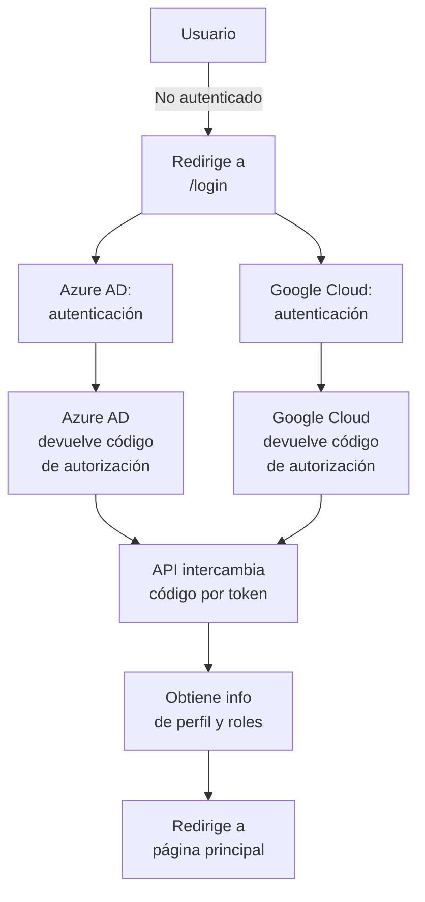
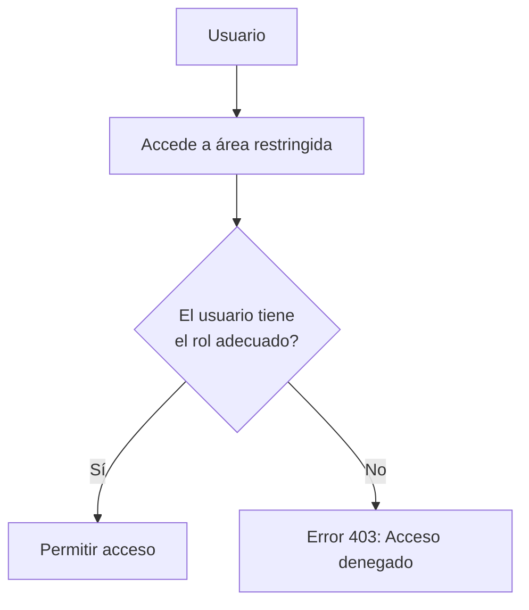

[](https://classroom.github.com/open-in-codespaces?assignment_repo_id=17471581)
# API Flask con Azure AD y MongoDB

## Descripción General

Este proyecto es una API desarrollada en **Flask**, que utiliza **Azure Active Directory (Azure AD)** para la autenticación y **MongoDB** para almacenar perfiles de usuarios y roles. Se implementa un sistema de **control de acceso basado en roles (RBAC)** que asegura que los usuarios solo puedan acceder a las secciones autorizadas de la aplicación.

---

## Objetivos del Proyecto

### 1. **Autenticación con Azure Active Directory (Azure AD)**
- Implementar un sistema de inicio de sesión utilizando **Azure AD** que restringe el acceso solo a los correos electrónicos autorizados de la organización.
  
### 2. **Control de Acceso Basado en Roles**
- Definir y gestionar roles de usuario asignados en **Azure AD** para controlar el acceso a diferentes partes de la aplicación:
  - Los usuarios con el rol **admin** tienen acceso a las secciones administrativas.
  - Los usuarios con el rol **user** tienen acceso a la interfaz de usuario.

### 3. **Seguridad Mejorada**
- Asegurar la validación de tokens y la protección de información sensible mediante conexiones seguras (TLS) y la autenticación de usuarios a través de **Azure AD**.

---

## Flujo de Autenticación

Esta API sigue un flujo de autenticación utilizando **Azure AD** y **MSAL**. El flujo completo se describe a continuación.

### Diagrama de Flujo de Autenticación


### Flujo de Control de Acceso Basado en Roles


## Tecnologías Utilizadas
- **Flask**: Framework web minimalista para Python.
- **Azure Active Directory (Azure AD)**: Proveedor de autenticación para permitir el acceso con cuentas de Microsoft.
- **MSAL (Microsoft Authentication Library)**: Biblioteca que gestiona la autenticación y la obtención de tokens de Azure AD.
- **MongoDB**: Base de datos NoSQL para almacenar la información de los usuarios.
- **Python Dotenv**: Maneja variables de entorno desde un archivo `.env`.
- **Certifi**: Para asegurar conexiones TLS confiables con MongoDB.
- **Gunicorn**: Servidor WSGI para servir la aplicación Flask en producción.
- **Google Cloud**: Plataforma en la nube que proporciona servicios adicionales como autenticación alternativa, almacenamiento y análisis, y puede complementar la infraestructura junto con Azure, permitiendo un entorno híbrido.

## Instalación y Configuración

### Requisitos Previos
Python 3.12.5 o superior. Cuenta de Azure AD registrada. MongoDB Atlas o cualquier servidor MongoDB.

### Pasos para la Instalación
Clonar el repositorio:
```bash
git clone https://github.com/UPT-FAING-EPIS/proyecto-si8811a-2024-ii-u1-apis-y-funciones-meza-y-churacutipa.git
```
Instalar las dependencias:

```bash
cd proyecto-si8811a-2024-ii-u1-apis-y-funciones-meza-y-churacutipa
pip install -r requirements.txt
```
Configurar las variables de entorno: Crea un archivo .env basado en el archivo .env.example y completa las variables requeridas:
```bash
SECRET_KEY=valor_a_reemplazar
CLIENT_ID=valor_a_reemplazar
CLIENT_SECRET=valor_a_reemplazar
AUTHORITY=valor_a_reemplazar
REDIRECT_PATH=valor_a_reemplazar
MONGO_URI=valor_a_reemplazar
```

Iniciar la aplicación: Ejecuta la aplicación localmente:
```bash
python api_login.py
```

Para entornos de producción, usa Gunicorn:
```bash
gunicorn api_login:app
```
## Uso de Docker Hub
La imagen de la API está disponible en Docker Hub, lo que facilita su despliegue en diferentes entornos sin necesidad de construirla localmente. Puedes acceder a ella en el siguiente enlace:

[Docker Hub - Login API](https://hub.docker.com/repository/docker/marcomeza14/login_api)

## Uso de Docker
El proyecto incluye un archivo `Dockerfile` para facilitar la construcción y despliegue de la aplicación en un contenedor.

### Dockerfile
```dockerfile
# Usa una imagen base oficial de Python
FROM python:3.12.5-slim

# Establece el directorio de trabajo en el contenedor
WORKDIR /app

# Copia los archivos de requisitos al contenedor
COPY requirements.txt ./

# Instala las dependencias
RUN pip install --no-cache-dir -r requirements.txt

# Copia el resto de los archivos de la aplicación al contenedor
COPY . .

# Exponer el puerto en el que la aplicación Flask se ejecutará
EXPOSE 5000

# Define la variable de entorno para Flask
ENV FLASK_APP=api_login.py
ENV FLASK_RUN_HOST=0.0.0.0

# Ejecuta la aplicación Flask
CMD ["flask", "run"]
```
Docker Compose
El archivo docker-compose.yml permite gestionar la aplicación y las variables de entorno de forma sencilla.
```yaml
services:
  app:
    build:
      context: .
      dockerfile: Dockerfile
    ports:
      - "5000:5000"
    env_file:
      - .env
```
### Pasos para ejecutar con Docker

Construir la imagen y ejecutar los contenedores:

```bash
docker-compose build
docker-compose up -d
```
### Base de Datos (MongoDB Atlas)

La API utiliza MongoDB para almacenar la información de los usuarios:

- **Base de Datos**: `db_Upt_Usuarios`
- **Colección**: `Accesos_users`

Los datos almacenados incluyen:

- **email**: Correo electrónico del usuario.
- **name**: Nombre del usuario.
- **roles**: Roles asignados al usuario.
- **status**: Estado de autenticación.
- **last_login**: Última fecha de inicio de sesión.

Video :
[URL Video](https://youtu.be/e52IbrZbrQQ)


